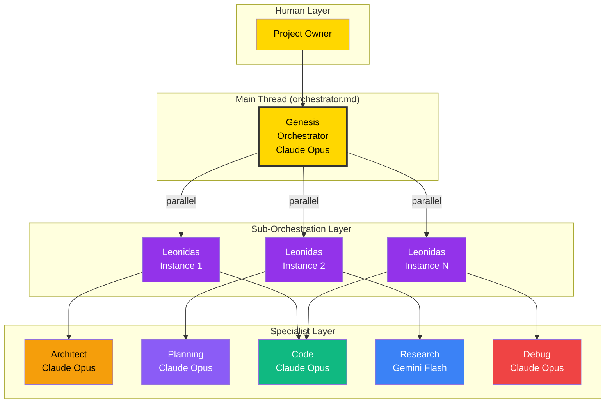

# OpenCode Bootstrap

<!-- @META: Session Initialization Protocol -->
<!--
    File: .opencode/BOOTSTRAP.md
    Version: 4.0.0
    Created: 2026-01-06
    Updated: 2026-01-07
    Scope: Universal session entry point for all agents
    Template: Agnostic - Ready for any project
-->

<!-- @NOTE(boot-001): Critical Entry Point -->
> **READ THIS FIRST** - This file is the SINGLE SOURCE OF TRUTH for agent initialization.
> It MUST be read at the start of every session to establish context.

---

## Quick Context

<!-- @NOTE(ctx-001): Project Identity -->
<!-- @CONFIGURE: Update this table for your project -->
| Attribute | Value |
|-----------|-------|
| **Project** | Your Project Name |
| **Mission** | Your project's mission statement |
| **Owner** | Project Owner |
| **Repository** | This repository root |

<!-- @NOTE(ctx-002): Product Definition -->
<!-- @CONFIGURE: Replace with your project description -->
**This project** should have a clear description here. Update this section to describe:
- What your project does
- Core features and capabilities
- Target users or use cases
- Key differentiators

---

## Session Protocol

<!-- @RULE: Session Start Protocol -->
> **Execute this checklist at the start of EVERY session**:
> 1. Read this `BOOTSTRAP.md`
> 2. Check `.opencode/memory/project.yaml` for structure
> 3. Check `.opencode/tasks/sprint.yaml` for current work
> 4. Review any active task in `.opencode/tasks/queue/`
> 5. Resume work or ask the project owner for direction

<!-- @NOTE(flow-001): Context Loading Order -->


---

## Directory Map

<!-- @REF(.opencode/): Agent Infrastructure Root -->
```
.opencode/                      # Agent Intelligence Layer
├── BOOTSTRAP.md               # THIS FILE - Start here every session
│
├── agent/                     # Agent Definitions (7 agents)
│   ├── orchestrator.md        # MAIN THREAD - Human interface (Genesis)
│   ├── leonidas.md            # Sub-orchestrator (autonomous execution)
│   ├── architect.md           # System design (specs only, no code)
│   ├── planning.md            # Strategic planning, RFCs, decomposition
│   ├── code.md                # Implementation (the actual coder)
│   ├── research.md            # Investigation and discovery
│   └── debug.md               # Root cause analysis
│
├── skill/                     # Loaded Knowledge Modules
│   ├── opencode-specs/        # OpenCode engine documentation
│   ├── code-review/           # Code review methodology
│   ├── rfc-creation/          # RFC writing guide
│   ├── task-decomposition/    # Breaking down large initiatives
│   └── codebase-analysis/     # Analyzing unfamiliar code
│
├── command/                   # Slash Commands
│   ├── analyze.md             # /analyze - Codebase analysis
│   ├── review.md              # /review - Code review
│   ├── decompose.md           # /decompose - Task breakdown
│   └── rfc.md                 # /rfc - Create RFC document
│
├── memory/                    # Persistent Knowledge
│   ├── project.yaml           # Project structure and metadata
│   └── README.md              # Memory system docs
│
├── tasks/                     # Work Queue
│   ├── sprint.yaml            # Current sprint tasks
│   ├── queue/                 # Ready-to-execute tasks
│   └── archive/               # Completed work history
│
├── workflows/                 # Workflow Definitions
│   ├── definitions/           # Workflow templates
│   └── instances/             # Active workflow runs
│
├── context/                   # Session State (ephemeral)
│
├── integrations/              # External Connections
│   ├── mcp/                   # Model Context Protocol servers
│   └── webhooks/              # Outbound notifications
│
├── specs/                     # Reference Documentation
│   ├── ORCHESTRATION_ARCHITECTURE.md
│   ├── AGENTS_SKILLS_ARCHITECTURE.md
│   └── AVAILABLE_MODELS.md
│
└── docs/                      # Extended Documentation
    ├── architecture.md        # Full system architecture
    ├── workflows.md           # Workflow patterns guide
    ├── migration.md           # Migration from .skills/
    └── diagrams/              # Mermaid source files
```

---

## Critical Rules

<!-- @WARN: Non-Negotiable Rules -->
> **These are NON-NEGOTIABLE. Violating these will break the system.**

### 1. Package Manager
<!-- @RULE: Package Manager -->
<!-- @CONFIGURE: Set your preferred package manager -->
> Use the project's preferred package manager consistently.
> Check `package.json` or project docs for the required tool (npm, yarn, pnpm, bun).

### 2. Test Co-location
<!-- @RULE: Colocated Tests -->
<!-- @CONFIGURE: Adjust if your project uses a different test structure -->
> Tests SHOULD be in the same directory as source (e.g., `src/foo.ts` and `src/foo.test.ts`).
> Check `AGENTS.md` or project conventions for specific test placement rules.

### 3. Documentation Hierarchy
<!-- @RULE: Doc Chain -->
> `AGENTS.md` files form a chain:
> Root `AGENTS.md` -> Package `AGENTS.md` -> Module `AGENTS.md`.
> Child documents override parent for their specific scope.

### 4. Agent Delegation
<!-- @RULE: Orchestrator Delegation -->
> Leonidas orchestrates -> Specialized agents execute.
> NEVER implement code directly if you are the orchestrator.
> ALWAYS delegate to the appropriate specialist.

### 5. Git Safety
<!-- @RULE: Git Safety -->
> NEVER force push, amend pushed commits, or skip hooks.
> ALWAYS verify with `git status` before committing.
> WARN before any destructive git operation.

### 6. Source Citation (SOP-001) - CRITICAL
<!-- @RULE: Mandatory Source Citation -->
> **EVERY piece of information MUST cite its source.** This is NON-NEGOTIABLE.
> Without source citations, agents cannot navigate the knowledge graph.
> 
> **See full protocol**: `AGENTS.md#sop-001` or section below.

### 7. Inline Audit Protocol (SOP-002) - CRITICAL
<!-- @RULE: Standardized Inline Annotations -->
> **Use standardized tags for findings.** This enables terminal-based discovery.
> Mandatory during code reviews and audits.
> 
> **See full protocol**: `AGENTS.md#sop-002` or section below.

### 8. Parallel Decomposition Protocol (SOP-003) - CRITICAL
<!-- @RULE: Intelligent Parallel Task Decomposition -->
> **ALL complex user requests MUST be decomposed into parallel Leonidas sub-agents.**
> This is the DEFAULT behavior of the main orchestrator thread.
> 
> **See full protocol**: Section below or `AGENTS.md#sop-003`.

---

## Parallel Decomposition Protocol (SOP-003)

<!-- @NOTE(sop-003): Native Parallel Execution Pattern -->
<!-- @WHY: Maximizes throughput by leveraging parallel sub-orchestrators for complex tasks -->

> **CRITICAL: This is the DEFAULT behavior when receiving user messages.**
> **The main thread orchestrates; Leonidas sub-agents execute in parallel.**

### Core Principle

```
+---------------------------------------------------------------------+
|                    MAIN THREAD (OpenCode)                            |
|  Role: Orchestrator - Receives user message, decomposes, delegates   |
|  NEVER executes complex tasks directly - ALWAYS delegates            |
+-----------------------------------+---------------------------------+
                                    |
                    PARALLEL DECOMPOSITION
                      (multiple Task calls)
                                    |
        +---------------------------+---------------------------+
        v                           v                           v
+---------------+         +---------------+         +---------------+
|   LEONIDAS    |         |   LEONIDAS    |         |   LEONIDAS    |
|   Sub-Agent   |         |   Sub-Agent   |         |   Sub-Agent   |
|               |         |               |         |               |
| - Own TodoList|         | - Own TodoList|         | - Own TodoList|
| - Full auton. |         | - Full auton. |         | - Full auton. |
| - Delegates   |         | - Delegates   |         | - Delegates   |
|   to specs    |         |   to specs    |         |   to specs    |
+---------------+         +---------------+         +---------------+
        |                         |                         |
    [Result]                  [Result]                  [Result]
        |                         |                         |
        +-------------------------+-------------------------+
                                  v
                    +-------------------------+
                    |      MAIN THREAD        |
                    |  Consolidates results   |
                    |  Reports to user        |
                    +-------------------------+
```

### When to Decompose (ALWAYS for complex tasks)

| Criteria | Action |
|----------|--------|
| Task has 3+ independent subtasks | **DECOMPOSE** into parallel Leonidas agents |
| Task affects multiple packages/modules | **DECOMPOSE** by package/module |
| Task requires research + implementation | **DECOMPOSE** research and code in parallel |
| Task is an audit or mapping | **DECOMPOSE** by domain/area |
| Single simple task | Execute directly (no decomposition needed) |

### Decomposition Algorithm

```python
def handle_user_message(message):
    # Step 1: Analyze complexity
    subtasks = analyze_and_decompose(message)
    
    # Step 2: If complex, parallelize
    if len(subtasks) >= 2 and are_independent(subtasks):
        # Launch multiple Leonidas in PARALLEL (single message, multiple Task calls)
        results = parallel_launch([
            Task(subagent_type="leonidas", prompt=subtask, ...)
            for subtask in subtasks
        ])
        
        # Step 3: Consolidate and report
        consolidated = consolidate_results(results)
        report_to_user(consolidated)
    else:
        # Simple task: execute directly or single delegation
        execute_or_delegate(message)
```

### Leonidas Sub-Agent Template

When delegating to Leonidas, use this structure:

```markdown
## LEONIDAS MISSION: [Clear Mission Title]

### CONTEXT
<!-- @REF(source): Why this task exists -->
[Provide complete context - the sub-agent has NO memory of previous conversation]

### OBJECTIVE
[Single, clear deliverable]

### TASKS
1. [Specific task 1]
2. [Specific task 2]
3. [Specific task 3]

### OUTPUT FORMAT
[Exact format expected - files to create, structure to follow]

### SUCCESS CRITERIA
- [ ] [Verifiable criterion 1]
- [ ] [Verifiable criterion 2]

### AUTONOMY GRANT
You have TOTAL AUTONOMY to complete this mission:
1. Create your own TodoList using TodoWrite
2. Delegate to specialist agents (code, debug, research, architect)
3. Make all implementation decisions
4. Report ONLY the final summary when complete

DO NOT:
- Ask clarifying questions
- Report intermediate progress
- Request approval for decisions
```

### Practical Examples

#### Example 1: Repository Audit
**User**: "Do a complete repository audit"

**Main Thread Response**:
```
# Decompose into parallel Leonidas agents:
Task(leonidas) -> Map root structure
Task(leonidas) -> Map TODO files
Task(leonidas) -> Map RFCs and specs
Task(leonidas) -> Map documentation
Task(leonidas) -> Map frontend package (e.g., apps/, client/)
Task(leonidas) -> Map backend package (e.g., api/, server/)
Task(leonidas) -> Map shared packages

# All launched in SINGLE message with multiple Task calls
# Wait for all to complete
# Consolidate results into master report
```

#### Example 2: Feature Implementation
**User**: "Implement feature flags system"

**Main Thread Response**:
```
# Decompose into parallel work:
Task(leonidas) -> Research existing patterns (research-focused)
Task(leonidas) -> Design database schema (architect-focused)
Task(leonidas) -> Implement backend service (code-focused)
Task(leonidas) -> Implement frontend toggle (code-focused)
Task(leonidas) -> Write tests (code-focused)

# Consolidate and verify integration
```

#### Example 3: Bug Investigation
**User**: "Fix the WebSocket connection issues"

**Main Thread Response**:
```
# Decompose investigation:
Task(leonidas) -> Analyze client-side code
Task(leonidas) -> Analyze server-side handling
Task(leonidas) -> Review network layer
Task(leonidas) -> Check reconnection logic

# Consolidate findings, then delegate fix to code agent
```

### Key Rules

<!-- @RULE: Parallel First -->
> **ALWAYS prefer parallel execution** over sequential when subtasks are independent.
> Launch multiple Task calls in a SINGLE message for maximum throughput.

<!-- @RULE: Complete Context -->
> **Each Leonidas sub-agent receives COMPLETE context** - they have no memory.
> Include all necessary information in the prompt itself.

<!-- @RULE: Autonomy Grant -->
> **Sub-agents have FULL AUTONOMY** including their own TodoList.
> They should NOT ask questions or report intermediate progress.

<!-- @RULE: Consolidation Responsibility -->
> **Main thread is responsible for consolidation** of all sub-agent results.
> Create unified reports, resolve conflicts, report final summary to user.

### Anti-Patterns (DO NOT)

| Anti-Pattern | Correct Approach |
|--------------|------------------|
| Execute complex task directly in main thread | Decompose and delegate to Leonidas |
| Launch sub-agents sequentially (one at a time) | Launch all independent sub-agents in parallel |
| Ask user for clarification before decomposing | Make reasonable assumptions, decompose, execute |
| Have sub-agents ask questions | Provide complete context in prompt |
| Wait for approval between sub-tasks | Execute autonomously, report only final result |

---

## Source Citation Protocol (SOP-001)

<!-- @NOTE(sop-001): Mandatory Traceability Standard -->
<!-- @REF(AGENTS.md#sop-001): Master definition of this SOP -->
> **This SOP applies to ALL agents, ALL actions, ALL outputs.**

### Purpose
Enable agents to navigate the codebase by maintaining a complete audit trail.
Every fact, task, decision, or reference MUST link back to its origin.

### Quick Reference - Required Formats

| Context | Format | Example |
|---------|--------|---------|
| **Markdown** | `<!-- @REF(file:line) -->` | `<!-- @REF(backend/TODO.md:23): Billing fix -->` |
| **YAML tasks** | `source:` field | `source: "docs/TODO.md"` |
| **YAML tasks** | `related_files:` | `related_files: ["src/billing.ts"]` |
| **Code** | `// @REF(file)` | `// @REF(AGENTS.md#sop-001)` |
| **Inline nav** | `path:line` | `src/service.ts:45` |

### YAML Task Template (Mandatory Fields)
```yaml
- id: "TASK-XXX"
  title: "Task Title"
  source: "path/to/origin.md"        # REQUIRED
  source_line: 45                     # Optional but recommended
  related_files:                      # REQUIRED  
    - "src/module/file.ts"
  description: |
    <!-- @REF(source:line): Context -->
    Description here...
```

### Agent Compliance (Before completing ANY task)
- [ ] All YAML files have `source:` and `related_files:`
- [ ] All docs have `@REF` or `@CITE` annotations
- [ ] All extracted info links to `origin_file:line`
- [ ] All code changes reference task/requirement

---

## Inline Audit Protocol (SOP-002)

<!-- @NOTE(sop-002): Standardized Findings Tagging -->
<!-- @REF(AGENTS.md#sop-002): Master definition of this SOP -->
> **Use standardized tags to enable terminal discovery (ripgrep/grep).**

| Tag | Purpose | Example |
|-----|---------|---------|
| `@BUG` | Logic errors | `// @BUG: Race condition...` |
| `@VULN` | Security vulnerabilities | `// @VULN: SQL Injection...` |
| `@SECURITY` | Security concerns | `// @SECURITY: Hardcoded key...` |
| `@TECH-DEBT` | Architectural debt | `// @TECH-DEBT: Refactor this...` |
| `@TODO` | Pending tasks | `// @TODO: Add tests...` |
| `@PERF` | Performance bottlenecks | `// @PERF: N+1 query...` |

**Terminal Discovery:** `rg "@BUG"` or `rg "@VULN"`

---

## Agent Hierarchy

<!-- @REF(.opencode/docs/architecture.md): Full Architecture -->
<!-- @REF(.opencode/agent/orchestrator.md): Main Thread Definition -->

### Three-Tier Architecture



### Agent Selection Matrix

<!-- @NOTE(matrix-001): Agent Roles -->
| Task Type | Agent | Model | Color |
|-----------|-------|-------|-------|
| Orchestration, Multi-step projects | `leonidas` | Gemini Pro | Purple |
| Architecture, Design, RFCs | `architect` | Claude Opus | Orange |
| Strategic Planning, Decomposition | `planning` | Claude Opus | Violet |
| Implementation, Refactoring | `code` | Claude Opus | Green |
| Research, Exploration | `research` | Gemini Flash | Blue |
| Debugging, Root Cause | `debug` | Claude Opus | Red |

---

## Project Structure

### Example Repository Layout

<!-- @CONFIGURE: Update this to match your project structure -->
<!-- @NOTE: This is an example layout - adapt to your needs -->
```
your-project/
├── apps/                      # Application packages
│   ├── web/                   # Web frontend (e.g., React, Vue, Next.js)
│   ├── api/                   # Backend API (e.g., Node, Python, Go)
│   └── mobile/                # Mobile app (optional)
│
├── packages/                  # Shared packages/libraries
│   ├── ui/                    # Shared UI components
│   ├── utils/                 # Shared utilities
│   └── config/                # Shared configuration
│
├── infrastructure/            # Deployment and infrastructure
│   ├── docker/                # Docker configurations
│   └── k8s/                   # Kubernetes manifests (optional)
│
├── docs/                      # Project documentation
│
├── .opencode/                 # THIS - Agent system
│
└── AGENTS.md                  # Root agent documentation
```

### Key Technologies

<!-- @CONFIGURE: Update this to match your tech stack -->
<!-- @NOTE: Example tech stack - replace with your actual stack -->
| Layer | Stack |
|-------|-------|
| **Frontend** | (e.g., React, Vue, Next.js, TypeScript) |
| **Backend** | (e.g., Node.js, Python, Go, Rust) |
| **Database** | (e.g., PostgreSQL, MongoDB, Redis) |
| **AI/LLM** | OpenCode, Claude (Anthropic), Gemini (Google) |
| **Infra** | (e.g., Docker, Kubernetes, Vercel, AWS) |

---

## Current Focus

<!-- @DYNAMIC: Update this section based on active sprint -->
<!-- @REF(.opencode/tasks/sprint.yaml): Active Tasks -->

### Priority Order

<!-- @RULE: Priority Handling -->
1. **Critical** - System broken, blocking all work
2. **High** - Important feature or blocking issue
3. **Medium** - Standard work item
4. **Low** - Nice to have, backlog filler

### Quick Task Commands

```bash
# Check current sprint
cat .opencode/tasks/sprint.yaml

# See queued tasks
ls .opencode/tasks/queue/

# Check project memory
cat .opencode/memory/project.yaml
```

---

## Emergency Recovery

### Lost Context?
<!-- @NOTE(rec-001): Context Recovery -->
1. Re-read this `BOOTSTRAP.md`
2. Load `memory/project.yaml` for project structure
3. Check git log for recent changes: `git log --oneline -20`
4. Ask the project owner: "What should I work on?"

### Session Crashed?
<!-- @NOTE(rec-002): Session Recovery -->
1. Check `tasks/queue/` for in-progress tasks
2. Look for uncommitted changes: `git status`
3. Review conversation history if available
4. Resume from last known state

### Conflicting Information?
<!-- @RULE: Truth Precedence -->
**Precedence (highest to lowest):**
1. Direct project owner instruction (in conversation)
2. This `BOOTSTRAP.md`
3. `AGENTS.md` files
4. Spec documents in `docs/`
5. Code comments

---

## Skills Reference

<!-- @NOTE(skill-001): Skill Usage -->
Load a skill for specialized guidance:

| Skill | When to Use | Load Command |
|-------|-------------|--------------|
| `opencode-specs` | Understanding OpenCode capabilities | `/skill opencode-specs` |
| `code-review` | Reviewing code quality | `/skill code-review` |
| `rfc-creation` | Writing formal RFC documents | `/skill rfc-creation` |
| `task-decomposition` | Breaking down large initiatives | `/skill task-decomposition` |
| `codebase-analysis` | Exploring unfamiliar code | `/skill codebase-analysis` |

---

## Quick Reference

### Documentation Links
- [Architecture](docs/architecture.md) - Full system design
- [Workflows](docs/workflows.md) - Agent workflow patterns
- [Migration](docs/migration.md) - Skills migration guide
- [Orchestration Specs](specs/ORCHESTRATION_ARCHITECTURE.md)

### Version History

| Version | Date | Changes |
|---------|------|---------|
| 4.0.0 | 2026-01-07 | Refactored to project-agnostic template |
| 3.0.0 | 2026-01-07 | Added SOP-003: Parallel Decomposition Protocol |
| 2.0.0 | 2026-01-07 | Full semantic audit and standardization |
| 1.0.0 | 2026-01-06 | Initial bootstrap document |

---

<!-- @NOTE(final-001): Final Authority -->
> **Remember**: When in doubt, ask the project owner. They have final authority on all decisions.
