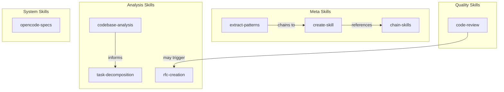
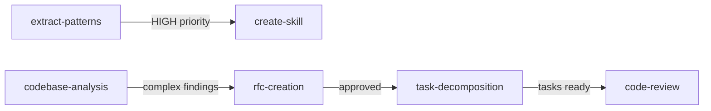

# OpenCode Skill System

<!-- @META: Skill Library Index -->
<!--
    File: .opencode/skill/README.md
    Version: 2.0.0
    Created: 2025-12-18
    Updated: 2026-01-07
    Scope: Index and documentation for the OpenCode skill system
-->

<!-- @NOTE(skill-def): Definition -->
> A living framework of organizational knowledge that evolves, connects, and self-improves through skill chaining and pattern extraction.

---

## Quick Reference

<!-- @NOTE(skill-usage): Quick Reference -->
| Command | Description |
|---------|-------------|
| Load a skill | Agent: `skill("skill-name")` |
| Chain skills | Use `>> CHAIN TO: skill-name` in output |
| Create new skill | Follow `create-skill/SKILL.md` |

---

## Available Skills

### Meta Skills (Knowledge Management)

<!-- @REF(skill/create-skill/SKILL.md): Create Skill -->
<!-- @REF(skill/extract-patterns/SKILL.md): Extract Patterns -->
<!-- @REF(skill/chain-skills/SKILL.md): Chain Skills -->
| Skill | Description | Complexity |
|-------|-------------|------------|
| [create-skill](./create-skill/SKILL.md) | Create and document new skills | Medium |
| [extract-patterns](./extract-patterns/SKILL.md) | Extract implicit patterns from conversations | High |
| [chain-skills](./chain-skills/SKILL.md) | Chain skills into composed workflows | High |
| [manage-task-boundaries](./manage-task-boundaries/SKILL.md) | Manage mode transitions and progress | Medium |
| [analyze-agent-framework](./analyze-agent-framework/SKILL.md) | Deep analysis of AI agent frameworks | High |

### Architecture & Analysis

| Skill | Description | Complexity |
|-------|-------------|------------|
| [codebase-analysis](./codebase-analysis/SKILL.md) | Analyze unfamiliar codebase structure | Medium |
| [rfc-creation](./rfc-creation/SKILL.md) | Create formal RFC documents | Medium |
| [task-decomposition](./task-decomposition/SKILL.md) | Break down large initiatives | Medium |
| [os-architect](./os-architect/SKILL.md) | Design OS subsystems and kernel | High |
| [data-architect](./data-architect/SKILL.md) | Design data schemas and storage | High |
| [office-suite-architect](./office-suite-architect/SKILL.md) | Design Office-compatible suite | High |
| [google-platform-architect](./google-platform-architect/SKILL.md) | Clone Android/Workspace features | High |

### Quality & Review

| Skill | Description | Complexity |
|-------|-------------|------------|
| [code-review](./code-review/SKILL.md) | Review code for quality and issues | Low |
| [audit-code-review](./audit-code-review/SKILL.md) | Full-stack code audit | High |
| [audit-ui-vibeos](./audit-ui-vibeos/SKILL.md) | VibeOS UI/UX audit | High |
| [perf-optimizer](./perf-optimizer/SKILL.md) | Performance optimization | Medium |

### Backend Skills

| Skill | Description | Complexity |
|-------|-------------|------------|
| [create-api](./create-api/SKILL.md) | Create RESTful APIs for Hub | Medium |
| [migrate-database](./migrate-database/SKILL.md) | Database schema migrations | High |

### Frontend Skills

| Skill | Description | Complexity |
|-------|-------------|------------|
| [create-app-vibeos](./create-app-vibeos/SKILL.md) | Scaffold VibeOS applications | Medium |

### System Knowledge

| Skill | Description | Complexity |
|-------|-------------|------------|
| [opencode-specs](./opencode-specs/SKILL.md) | OpenCode agent engine specifications | High |

### Templates

<!-- @REF(skill/templates/): Templates Directory -->
| Template | Description |
|----------|-------------|
| [issue.mdx](./templates/issue.mdx) | Issue/problem/feature document |
| [plan.mdx](./templates/plan.mdx) | Implementation plan template |
| [rfc.mdx](./templates/rfc.mdx) | RFC research document |

---

## Skill Categories

<!-- @SCHEMA: Skill Graph -->


---

## Skill Relationships

### Chain Dependencies

<!-- @SCHEMA: Chain Graph -->


### Information Flow

<!-- @NOTE(skill-flow): Data Flow -->
| From | To | When |
|------|-----|------|
| `extract-patterns` | `create-skill` | High-priority patterns found |
| `codebase-analysis` | `rfc-creation` | Architecture decision needed |
| `rfc-creation` | `task-decomposition` | RFC approved |
| `code-review` | `extract-patterns` | Recurring patterns in reviews |

---

## How to Create New Skills

### 1. Identify the Need
<!-- @RULE: Creation Trigger -->
A skill should be created when:
- A pattern repeats 3+ times
- A workflow has clear phases
- Knowledge needs to be shared

### 2. Use the Meta-Skill
```
Load skill: create-skill
```

### 3. Follow SKILL.md Format

<!-- @SCHEMA: Skill Definition -->
```markdown
---
name: skill-name
version: 1.0.0
category: meta | backend | frontend | fullstack
complexity: low | medium | high
estimated_time: "30m"
---

# Skill: Name

> One-line description

## Purpose
[What and when to use]

## Approaches

### Quick (15 min)
[Simplified version]

### Complete (1 hour)
[Full version]

## Main Prompt
[The standalone prompt]

## Skill Chaining
[What it chains to/from]

## Evolution
[Version history]
```

### 4. Place in Correct Location
```
.opencode/skill/{skill-name}/SKILL.md
```

---

## How to Chain Skills

### 1. Define Chain Points

<!-- @SCHEMA: Chain Config -->
In your skill's `Skill Chaining` section:

```yaml
chains_to:
  - skill: target-skill
    trigger: "condition expression"
    input: [data to pass]
```

### 2. Execute Chain

<!-- @API: Chain Syntax -->
During skill execution, when trigger is met:

```
>> CHAIN TO: target-skill
>> INPUT: {data}
>> OUTPUT: Expected result
```

### 3. Chain Patterns

<!-- @NOTE(chain-patterns): Patterns -->
| Pattern | Use Case |
|---------|----------|
| **Linear** | A -> B -> C sequential |
| **Conditional** | IF x THEN B ELSE C |
| **Parallel** | A -> (B, C) concurrent |
| **Loop** | FOR EACH item: B |
| **Recovery** | ON ERROR: fallback |

See [chain-skills/SKILL.md](./chain-skills/SKILL.md) for details.

---

## Skill Evolution

### When to Update

<!-- @RULE: Update Triggers -->
1. **After execution**: Gap or improvement identified
2. **After feedback**: User suggests enhancement
3. **After extraction**: `extract-patterns` finds new pattern
4. **After conflict**: Information contradiction found

### How to Document

<!-- @SCHEMA: Version History -->
```markdown
## Evolution

### v1.1 (YYYY-MM-DD)
- Change made
- Reason: [motivation]

### v1.0 (YYYY-MM-DD)
- Initial version
```

---

## Best Practices

### Skill Design

<!-- @RULE: Design Principles -->
1. **Single Responsibility**: One skill, one purpose
2. **Composable**: Skills should chain cleanly
3. **Self-Contained**: Executable without context
4. **Versioned**: Track evolution over time

### Documentation

<!-- @RULE: Docs Principles -->
1. **Purpose First**: Lead with why/when
2. **Multiple Approaches**: Quick/Complete/Incremental
3. **Concrete Examples**: Show, don't just tell
4. **Cross-References**: Link to related skills

### Quality Checklist

<!-- @RULE: QC Checklist -->
- [ ] Purpose is clear in 10 seconds
- [ ] Works without additional context
- [ ] Each step is actionable
- [ ] Outputs are verifiable
- [ ] Follows existing patterns
- [ ] Tested at least once

---

## Migration from .skills/

<!-- @NOTE(migration): Legacy -->
This system migrates and enhances skills from the legacy `.skills/` directory:

| Legacy | New Location | Status |
|--------|--------------|--------|
| `.skills/chain-skills/` | `chain-skills/SKILL.md` | Migrated |
| `.skills/extract-patterns/` | `extract-patterns/SKILL.md` | Migrated |
| `.skills/create-skill/` | `create-skill/SKILL.md` | Migrated |
| `.skills/templates/` | `templates/` | Migrated |
| `.skills/analyze-agent-framework/` | `analyze-agent-framework/SKILL.md` | Migrated |
| `.skills/audit-code-review/` | `audit-code-review/SKILL.md` | Migrated |
| `.skills/audit-ui-vibeos/` | `audit-ui-vibeos/SKILL.md` | Migrated |
| `.skills/create-api/` | `create-api/SKILL.md` | Migrated |
| `.skills/create-app-vibeos/` | `create-app-vibeos/SKILL.md` | Migrated |
| `.skills/data-architect/` | `data-architect/SKILL.md` | Migrated |
| `.skills/google-platform-architect/` | `google-platform-architect/SKILL.md` | Migrated |
| `.skills/manage-task-boundaries/` | `manage-task-boundaries/SKILL.md` | Migrated |
| `.skills/migrate-database/` | `migrate-database/SKILL.md` | Migrated |
| `.skills/office-suite-architect/` | `office-suite-architect/SKILL.md` | Migrated |
| `.skills/os-architect/` | `os-architect/SKILL.md` | Migrated |
| `.skills/perf-optimizer/` | `perf-optimizer/SKILL.md` | Migrated |

---

## Version History

| Version | Date | Changes |
|---------|------|---------|
| 2.0.0 | 2026-01-06 | Complete migration with enhanced format |
| 1.0.0 | 2025-12-18 | Initial skill system |
