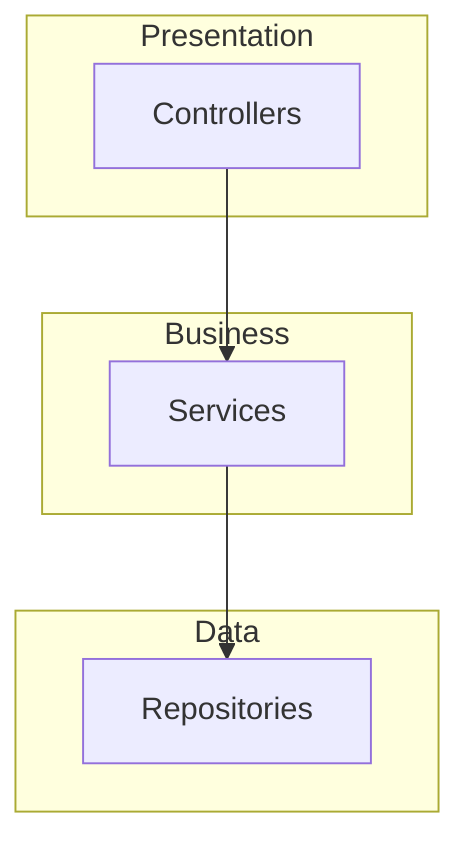

# Skill: Codebase Analysis

> Systematic analysis of codebase structure, patterns, and architecture for unfamiliar projects.

---

## Purpose

Understand a codebase through systematic discovery:

- **Structure**: Directories, modules, packages
- **Technology**: Stack, dependencies, tools
- **Architecture**: Patterns, data flow, entry points
- **Quality**: Testing, documentation, conventions

**Use when**:
- Onboarding to new project
- Before major refactoring
- Architecture documentation
- Understanding dependencies

---

## Approaches

### Quick (15 min)
- Structure overview
- Technology identification
- Key entry points

### Complete (1 hour)
- Full analysis framework
- All phases documented
- Architecture diagram
- Recommendations

### Incremental
- Module by module
- Depth-first exploration
- Building mental model

---

## Main Prompt

```
Perform a **systematic codebase analysis** of the specified project.

## Target
[Project path or repository]

## Focus Area (Optional)
[e.g., "Backend services", "Authentication", "Data layer"]

---

## Phase 1: Structure Discovery

### Find Project Indicators
```bash
glob: "**/package.json"
glob: "**/Cargo.toml"
glob: "**/go.mod"
glob: "**/requirements.txt"
```

### Find Entry Points
```bash
glob: "**/main.{ts,tsx,js,py,go,rs}"
glob: "**/index.{ts,tsx,js}"
glob: "**/app.{ts,tsx,js,py}"
```

### Find Configuration
```bash
glob: "**/*.config.{ts,js,json}"
glob: "**/.*rc"
glob: "**/.*rc.{json,yaml,yml}"
```

---

## Phase 2: Architecture Mapping

### Find Routes/Endpoints
```bash
grep: "router\.|app\.(get|post|put|delete)"
grep: "@(Get|Post|Put|Delete)\("
```

### Find Data Models
```bash
grep: "@(Entity|Table|Model)\("
grep: "Schema\(|model\("
```

### Find Services
```bash
grep: "@(Injectable|Service)\("
grep: "class.*Service"
```

---

## Phase 3: Pattern Recognition

### Test Patterns
```bash
glob: "**/*.{test,spec}.{ts,tsx,js}"
grep: "(describe|it|test)\("
```

### Configuration Patterns
```bash
grep: "process\.env\."
grep: "config\.(get|load)"
```

### Logging Patterns
```bash
grep: "logger\.(info|warn|error)"
grep: "console\.(log|warn|error)"
```

---

## Phase 4: Documentation

### Output Report
```markdown
# Codebase Analysis: [Project]

## Summary
[2-3 sentence overview]

## Structure
[Directory tree with descriptions]

## Technology Stack
| Layer | Technology | Version |
|-------|------------|---------|
| ... | ... | ... |

## Architecture
[Pattern description + Mermaid diagram]

## Entry Points
| Entry | Location | Purpose |
|-------|----------|---------|
| ... | ... | ... |

## Data Models
| Model | Location | Description |
|-------|----------|-------------|
| ... | ... | ... |

## Observations
### Strengths
- [Positive findings]

### Areas for Improvement
- [Potential issues]

### Unknowns
- [Needs investigation]
```

---

## Confidence Levels

Tag findings with confidence:
- 🟢 HIGH: Verified multiple sources
- 🟡 MEDIUM: Inferred from code
- 🟠 LOW: Single source or assumption
- 🔴 HYPOTHESIS: Needs investigation
```

---

## Discovery Commands

### Structure Discovery

| Purpose | Pattern |
|---------|---------|
| Package files | `**/package.json` |
| Entry points | `**/main.{ts,js}`, `**/index.{ts,js}` |
| Config files | `**/*.config.{ts,js,json}` |
| Environment | `**/.env*` |
| Documentation | `**/README.md`, `**/AGENTS.md` |

### Architecture Discovery

| Purpose | Search |
|---------|--------|
| Routes | `router\.|app\.(get|post|put|delete)` |
| Models | `@(Entity|Table|Model)\(` |
| Services | `class.*Service` |
| Controllers | `@Controller\(` |
| Middleware | `middleware|interceptor` |

### Quality Discovery

| Purpose | Pattern |
|---------|---------|
| Tests | `**/*.{test,spec}.{ts,tsx,js}` |
| Coverage | `**/coverage/**` |
| Linting | `**/.eslint*`, `**/.prettier*` |
| Types | `**/tsconfig.json` |

---

## Output Template

```markdown
# Codebase Analysis: [Project Name]

## Executive Summary
[2-3 sentence overview]

## Project Structure
```
project/
├── src/           # Source code
├── tests/         # Test files
├── docs/          # Documentation
└── config/        # Configuration
```

## Technology Stack

| Layer | Technology | Version |
|-------|------------|---------|
| Runtime | Node.js | 20.x |
| Framework | React | 19.x |
| Testing | Vitest | 2.x |
| Database | PostgreSQL | 15 |

## Architecture Pattern

[Description: MVC, Hexagonal, Clean, etc.]



## Key Entry Points

| Entry | Location | Purpose |
|-------|----------|---------|
| Main | `src/main.ts` | Bootstrap |
| API | `src/routes/` | Routes |

## Observations

### Strengths
- [What's done well]

### Improvements
- [What could be better]

### Unknowns
- [Needs investigation]
```

---

## Skill Chaining

### Chains To
- **rfc-creation**: When architecture decision needed
  - Trigger: Complex findings requiring decision
  - Input: Problem statement

- **task-decomposition**: For improvement work
  - Trigger: Actionable improvements identified
  - Input: List of improvements

### Can Be Chained From
- Any onboarding or discovery task

---

## Evolution

### v2.0.0 (2026-01-06)
- Migrated to enhanced format
- Added multiple approaches
- Added skill chaining
- Added discovery commands reference

### v1.0.0 (2025-12-18)
- Initial version with analysis framework
