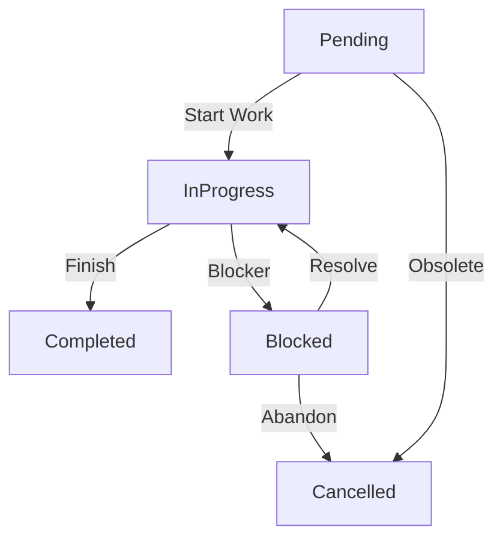

# SOP-TASK-MANAGEMENT: Standardized Task Operations

<!-- @META: Skill Definition -->
<!--
    File: SKILL.md
    Version: 1.0.0
    Created: 2026-01-07
    Scope: Task management procedure for OpenCode agents and humans
-->

## 1. Purpose & Authority

<!-- @NOTE(purpose): Goal -->
This skill defines the **Standard Operating Procedure (SOP)** for managing tasks within the NexusOS monorepo. It unifies scattered task sources into a coherent system.

<!-- @RULE: Authority -->
> **Single Source of Truth**: The `.opencode/tasks/` directory is the authoritative source for project tracking.
> - `backlog.yaml`: Unscheduled, future work.
> - `sprint.yaml`: Active, current iteration work.
> - **Legacy**: The `TASKS/` root folder is deprecated.

## 2. Task Schema Definition

<!-- @SCHEMA: Task Object -->
All tasks must strictly adhere to this YAML schema:

```yaml
tasks:
  - id: TASK-XXX                    # Format: TASK-[0-9]{3}
    title: "Descriptive Action"     # Starts with verb, concise
    status: pending                 # Enum: pending | in_progress | completed | blocked | cancelled
    priority: medium                # Enum: critical | high | medium | low
    assignee: unassigned            # Enum: leonidas | code | architect | research | [human_name]
    created: 2026-01-01             # ISO 8601 Date
    updated: 2026-01-02             # Last modification date
    files:                          # List of related files/directories
      - path/to/file.ts
    depends_on: []                  # List of ID strings (e.g. ["TASK-001"])
    context: |                      # Optional: Multiline description/context
      Additional details here.
```

### ID Convention
<!-- @RULE: Naming -->
- **Format**: `TASK-XXX` (e.g., `TASK-042`)
- **Sequence**: Monotonically increasing across the entire project.
- **Uniqueness**: IDs must be unique globally.

## 3. Task Lifecycle

<!-- @NOTE(lifecycle): State Machine -->


| Status | Meaning | Action Required |
|--------|---------|-----------------|
| `pending` | Scheduled but not started | Ready to pick up |
| `in_progress` | Actively being worked on | Update regularly |
| `completed` | Finished and verified | None (Historical) |
| `blocked` | Cannot proceed due to dependencies | Clear blocker to resume |
| `cancelled` | No longer needed | None (Historical) |

## 4. Operational Procedures

### 4.1 Creating a New Task

1. **Locate Source**: Open `.opencode/tasks/backlog.yaml` (default) or `sprint.yaml` (if immediate).
2. **Generate ID**: Find the highest existing ID in both files and increment by 1.
3. **Draft Entry**: Use the template below.
4. **Verify**: Ensure no ID collision.

### 4.2 Relating Tasks to Code

<!-- @RULE: Git Integration -->
> **Commit Messages**: MUST reference the task ID if applicable.

Format: `feat(scope): description (ref: TASK-XXX)`

Examples:
- `feat(hub): implement webrtc reconnection (ref: TASK-102)`
- `fix(kernel): resolve memory leak (ref: TASK-099)`

### 4.3 completing a Task

1. **Verify**: Ensure all success criteria are met.
2. **Update YAML**: Change status to `completed`.
3. **Update Date**: Update the `updated` field.
4. **Move**: (Optional) Move from `sprint.yaml` to archive if file gets too large (manual cleanup).

## 5. Templates

### New Task Template
```yaml
  - id: TASK-XXX
    title: ""
    status: pending
    priority: medium
    assignee: leonidas
    created: 2026-XX-XX
    files: []
    depends_on: []
```

### Full Example
```yaml
  - id: TASK-105
    title: "Implement SOP Task Management Skill"
    status: in_progress
    priority: high
    assignee: leonidas
    created: 2026-01-07
    updated: 2026-01-07
    files:
      - .opencode/skill/sop-task-management/SKILL.md
    depends_on: []
```
