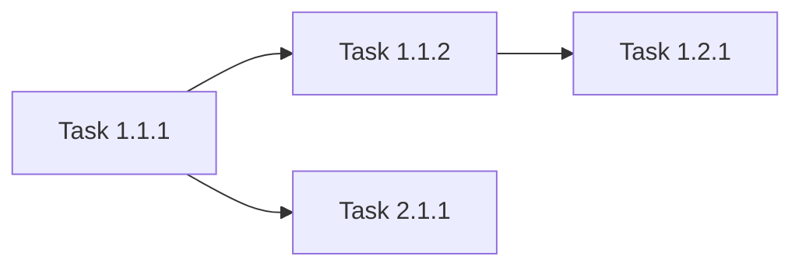

# Skill: Task Decomposition

> Break down large initiatives into manageable, atomic tasks with clear dependencies.

---

## Purpose

Transform large initiatives into executable work items:

- **Epics** (2-4 weeks)
- **Stories** (1-3 days)
- **Tasks** (< 4 hours)
- **Subtasks** (< 1 hour)

**Use when**:
- Starting a new initiative
- Planning sprint work
- Estimating effort
- Identifying parallelization

---

## Approaches

### Quick (15 min)
- Stories and Tasks only
- Critical path only
- Skip milestones

### Complete (1 hour)
- Full hierarchy
- Dependency graph
- Parallelization analysis
- Risk assessment
- Milestones

### Incremental
- Epic -> Stories first
- Add tasks as clarity increases
- Refine estimates over time

---

## Main Prompt

```
Perform **task decomposition** for the specified initiative.

## Initiative
[Name and description]

## Size
[S | M | L | XL]

## Team
[Size and composition]

---

## Phase 1: Epic Identification

For each major capability or phase:
- **Epic 1**: [Core functionality]
- **Epic 2**: [Supporting features]
- **Epic 3**: [Integration]
- **Epic 4**: [Testing & Polish]

Duration estimate per epic.

---

## Phase 2: Story Breakdown

For each Epic, identify user-facing chunks:

```markdown
### Epic: [Name]

#### Story 1.1: [User Story]
As a [user], I can [action] so that [benefit]
**Estimate**: X days

#### Story 1.2: [User Story]
As a [user], I can [action] so that [benefit]
**Estimate**: X days
```

---

## Phase 3: Task Definition

For each Story, define atomic tasks:

```markdown
- [ ] Task 1.1.1: [Specific step]
  - **Deliverable**: [What is produced]
  - **Acceptance**: [How to verify]
  - **Estimate**: Xh
  - **Dependencies**: [None | Task X.X.X]
```

### Atomic Task Criteria
- [ ] Completable in < 4 hours
- [ ] Single clear deliverable
- [ ] One owner
- [ ] Verifiable completion
- [ ] No hidden subtasks
- [ ] Clear acceptance criteria

---

## Phase 4: Dependency Mapping

### Identify Dependencies
```markdown
- Task A -> Task B (B requires A)
- Task C || Task D (can be parallel)
```

### Create Dependency Graph


---

## Phase 5: Critical Path Analysis

List tasks in critical order:
1. Task X.X.X (Xh)
2. Task X.X.X (Xh)
...

**Total Critical Path**: X hours

### Parallelization Opportunities
- Tasks A and B can run in parallel
- After Epic 1, Epics 2 and 3 can parallelize

---

## Phase 6: Risk Assessment

| Risk | Probability | Impact | Mitigation |
|------|-------------|--------|------------|
| [Risk] | Med | High | [Strategy] |

---

## Phase 7: Milestones

| Milestone | Date | Criteria |
|-----------|------|----------|
| M1: [Name] | Week X | [What's done] |
| M2: [Name] | Week X | [What's done] |

---

## Output Format

```markdown
# Task Breakdown: [Initiative Name]

## Overview
- **Size**: M
- **Total Estimate**: X weeks
- **Team Size**: X people

## Epics

### Epic 1: [Name]
**Duration**: X weeks
**Owner**: @person

#### Story 1.1: [User Story]
**Estimate**: X days

- [ ] Task 1.1.1: [Description]
  - Deliverable: [Output]
  - Acceptance: [Criteria]
  - Estimate: Xh
  - Dependencies: None

## Dependency Graph
[Mermaid diagram]

## Critical Path
[Ordered task list]

## Parallelization
[Opportunities]

## Risks
[Risk table]

## Milestones
[Milestone table]
```
```

---

## Size Classification

| Size | Duration | Team | Decomposition |
|------|----------|------|---------------|
| **S** | 1-2 weeks | 1-2 | Stories + Tasks |
| **M** | 2-8 weeks | 2-5 | Epics + Stories + Tasks |
| **L** | 2-6 months | 5-15 | Full hierarchy |
| **XL** | 6+ months | Multi-team | Full + Streams |

---

## Anti-Patterns

| Avoid | Why |
|-------|-----|
| Tasks > 8 hours | Too large to estimate |
| Vague acceptance | Can't verify done |
| Multiple deliverables | Not atomic |
| Hidden dependencies | Surprise blockers |
| "Research" without output | Unbounded work |
| Fake parallelism | Underestimated time |

---

## Skill Chaining

### Can Be Chained From
- **rfc-creation**: When RFC approved
  - Input: Approved recommendation

### Chains To
- **code-review**: For each completed task
  - Trigger: Task implementation complete

---

## Evolution

### v2.0.0 (2026-01-06)
- Migrated to enhanced format
- Added multiple approaches
- Added skill chaining
- Added anti-patterns

### v1.0.0 (2025-12-18)
- Initial version with hierarchy
