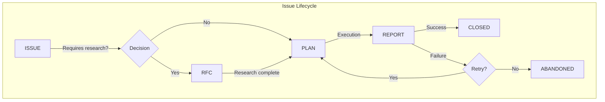

# Templates System

<!-- @META: Template Library -->
<!--
    File: .opencode/skill/templates/README.md
    Version: 2.0.0
    Created: 2025-12-27
    Updated: 2026-01-07
    Scope: Documentation for MDX templates usage
-->

<!-- @NOTE(tpl-def): Definition -->
> Structured templates for issues, plans, RFCs, and reports with YAML frontmatter for automation.

---

## Available Templates

<!-- @REF(skill/templates/): Templates -->
| Template | Purpose | When to Use |
|----------|---------|-------------|
| [issue.mdx](./issue.mdx) | Problem/feature document | New issue identified |
| [plan.mdx](./plan.mdx) | Implementation plan | Issue requires >1h or >3 files |
| [rfc.mdx](./rfc.mdx) | Research document | Multiple approaches need analysis |

---

## Template Lifecycle

<!-- @SCHEMA: Lifecycle Graph -->


---

## File Naming Conventions

### Location

<!-- @RULE: Colocation -->
Issues are **co-located** with affected code:

| Project | Location |
|---------|----------|
| Frontend (VibeOS) | `vibeos-react/docs/issues/` |
| Backend (Hub) | `backend/docs/issues/` |

### Format

<!-- @RULE: Naming Schema -->
```
ISSUE-{ID}-{kebab-case-description}.mdx
ISSUE-{ID}-PLAN-{PLAN_ID}-{strategy}.mdx
ISSUE-{ID}-PLAN-{PLAN_ID}-REPORT-{ATTEMPT}.mdx
ISSUE-{ID}-RFC-{RFC_ID}-{topic}.mdx
```

### Examples

- `ISSUE-042-auth-token-encryption.mdx`
- `ISSUE-042-PLAN-01-webcrypto-strategy.mdx`
- `ISSUE-042-PLAN-01-REPORT-01.mdx`
- `ISSUE-042-RFC-01-encryption-comparison.mdx`

---

## MDX Frontmatter

<!-- @SCHEMA: Frontmatter -->
All templates use **MDX with YAML frontmatter**:

```yaml
---
id: "ISSUE-042"
type: "issue" | "plan" | "report" | "rfc"
version: "1.0"
title: "Descriptive Title"
created: "YYYY-MM-DD"
updated: "YYYY-MM-DD"
author: "Name (Role)"
status: "OPEN" | "IN_PROGRESS" | "CLOSED"
tags:
  - "auth"
  - "security"
---
```

---

## AI Agent Instructions

### Protocol: VERIFY_BEFORE_ACT

<!-- @RULE: Verify Protocol -->
When working with issues:
1. **Check Working Directory** before commands
2. **Create PLAN** for issues >1h or >3 files
3. **Update Decision Log** for every major choice
4. **Update task.md** after completing steps

### Fractal Principle

<!-- @RULE: Fractal Scale -->
| Issue Type | Action |
|------------|--------|
| Simple (<1h, <=3 files) | Execute directly |
| Complex (>1h OR >3 files) | Create PLAN first |

### Traceability

<!-- @RULE: Traceability -->
Every decision must be logged:
```
| Date | Actor | Decision | Justification |
```

---

## Taxonomy

### Issue Types

<!-- @NOTE(tax-type): Types -->
| Type | Use |
|------|-----|
| `BUG` | Incorrect behavior |
| `FEATURE` | New functionality |
| `TECH_DEBT` | Refactoring |
| `SECURITY` | Vulnerabilities |
| `PERFORMANCE` | Optimization |
| `DOCUMENTATION` | Missing docs |

### Priorities

<!-- @NOTE(tax-prio): Priorities -->
| Priority | SLA |
|----------|-----|
| `CRITICAL` | Immediate |
| `HIGH` | Next sprint |
| `MEDIUM` | Backlog |
| `LOW` | If time permits |

### Status

<!-- @NOTE(tax-status): Status -->
| Status | Meaning |
|--------|---------|
| `OPEN` | Created, awaiting work |
| `IN_PROGRESS` | Being worked on |
| `BLOCKED` | Dependency unresolved |
| `IN_REVIEW` | Awaiting review |
| `CLOSED` | Complete |
| `ABANDONED` | Cancelled |

---

## Quick Start

1. Copy appropriate template
2. Rename following convention
3. Fill all frontmatter fields
4. Replace placeholder content
5. Delete instruction sections

---

## Related Skills

<!-- @REF(skill/): Related -->
- [create-skill](../create-skill/SKILL.md) - Skill creation methodology
- [rfc-creation](../rfc-creation/SKILL.md) - RFC writing guide
- [task-decomposition](../task-decomposition/SKILL.md) - Breaking down work

---

## Version History

| Version | Date | Changes |
|---------|------|---------|
| 2.0.0 | 2026-01-06 | Migrated to .opencode/skill/ |
| 1.0.0 | 2025-12-27 | Initial template system |
