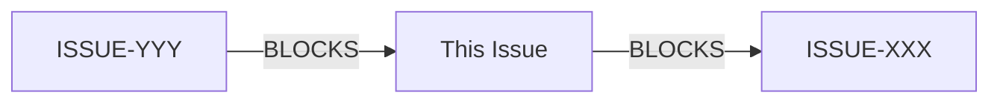

---
# ==============================================================================
# NEXUSOS ISSUE TEMPLATE v2.0
# ==============================================================================
# Naming: ISSUE-{ID}-{kebab-case-description}.mdx
# Location: {package}/docs/issues/
# ==============================================================================

id: "ISSUE-XXX"
type: "issue"
version: "1.0"
title: "[Action Verb] [Object] [Context]"

# Classification
issue_type: "BUG"        # BUG | FEATURE | TECH_DEBT | SECURITY | PERFORMANCE | DOCUMENTATION
priority: "MEDIUM"       # CRITICAL | HIGH | MEDIUM | LOW
status: "OPEN"           # OPEN | IN_PROGRESS | BLOCKED | IN_REVIEW | CLOSED | ABANDONED
estimate: "M"            # XS (<1h) | S (1-4h) | M (4-8h) | L (1-3d) | XL (>3d)

# Context
project: "vibeos-react"  # vibeos-react | backend
domain: "Frontend"       # Frontend | Backend | Full-Stack | DevOps
module: "system42/auth"  # Primary module path

# Temporal
created: "YYYY-MM-DD"
updated: "YYYY-MM-DD"
author: "Name (Role)"
assignee: null

# Relationships
blocks: []
depends_on: []
related: []
children:
  plans: []
  rfcs: []
  reports: []

# Origin
origin:
  source: "Agent"        # User | Agent | Audit | Skill | External
  actor: "Agent Name"
  context: "How this issue was identified"
  reference: null

# Tags
tags:
  - "auth"
  - "security"
---

# [ISSUE-XXX] Title: Action Verb + Object + Context

> **Project**: `{project}`
> **Domain**: {domain}
> **Module**: [{module}](../../{module}/README.md)

| Attribute | Value |
|-----------|-------|
| **Type** | `{issue_type}` |
| **Priority** | `{priority}` |
| **Status** | `{status}` |
| **Estimate** | `{estimate}` |
| **Created** | {created} |
| **Author** | {author} |

---

## Origin & Traceability

- **Source**: `{origin.source}` ({origin.actor})
- **Context**: {origin.context}
- **Reference**: {origin.reference || "N/A"}

---

## Relationships & Dependencies

### Dependency Graph



- **BLOCKS**: *Issues that can't proceed until this is done*
- **DEPENDS_ON**: *Issues that must complete first*
- **RELATED**: *Context without hard dependency*

---

## Decision Log

| Date | Actor | Decision/Action | Justification |
|:-----|:------|:----------------|:--------------|
| YYYY-MM-DD | **Name** | *Decision* | *Why: Basis* |

---

## Implementation History

### RFCs
*None yet*

### Plans
*None yet*

### Reports
*None yet*

---

## Short Description

*One sentence: [Action] [Object] in [Context] to [Outcome].*

> Example: "Implement rate limiting in AuthService to prevent brute force attacks."

---

## Long Description & Analysis

### Problem Statement

*Current behavior vs expected behavior.*

### Root Cause / Rationale

*For bugs: Why is this happening?*
*For features: Why do we need this?*

```typescript
// CURRENT STATE (path/to/file.ts)
const problematicCode = "example";
```

### Impact Analysis

| Dimension | Impact | Details |
|-----------|--------|---------|
| **User Experience** | Medium | *How affects users?* |
| **Architecture** | Low | *Core system changes?* |
| **Security** | High | *Any risks?* |
| **Performance** | Low | *Performance implications?* |

---

## Affected Files & Modules

### Primary Module
- **Module**: [{module}](../../{module}/README.md)
- **Documentation**: *Link to docs*

### Files

| File | Action | Description |
|------|--------|-------------|
| [file.ts](../../path/file.ts) | MODIFY | *Changes* |
| [new.ts](../../path/new.ts) | CREATE | *Purpose* |

---

## Strategy & Approach

### Options Analysis

| Option | Approach | Pros | Cons |
|--------|----------|------|------|
| **A** | *Description* | *Benefits* | *Drawbacks* |
| **B** | *Description* | *Benefits* | *Drawbacks* |

### Selected Strategy

- **Recommendation**: Option _
- **Reasoning**: *Justification*

### Requires RFC?

- [ ] **Yes** - Complex decision -> Create RFC first
- [ ] **No** - Clear path -> Create PLAN directly

### Next Steps

- [ ] Create `ISSUE-XXX-RFC-01-...` (if research needed)
- [ ] Create `ISSUE-XXX-PLAN-01-...` (implementation plan)
- [ ] Create feature branch `feature/issue-xxx-...`

---

## Acceptance Criteria

### Functional
- [ ] *Criterion 1*
- [ ] *Criterion 2*

### Technical
- [ ] `pnpm build` passes
- [ ] `pnpm test` passes
- [ ] `pnpm lint` passes

### Documentation
- [ ] README updated (if API changed)
- [ ] JSDoc/TSDoc added
- [ ] Decision Log updated

---

## Attachments

### Screenshots / Recordings
*Attach visual evidence*

### Related Documents
*External specs, RFCs*
