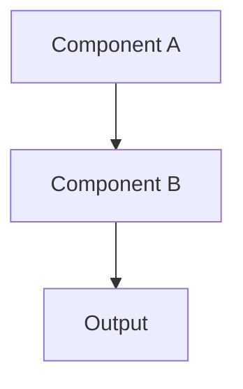

---
# ==============================================================================
# NEXUSOS IMPLEMENTATION PLAN TEMPLATE v2.0
# ==============================================================================
# Naming: ISSUE-{ID}-PLAN-{PLAN_ID}-{kebab-case-strategy}.mdx
# Location: Same folder as parent issue
# Prerequisite: Parent issue must exist
# ==============================================================================

id: "ISSUE-XXX-PLAN-XX"
type: "plan"
version: "1.0"
title: "Implementation Plan: [Strategy Name]"

# Parent Relationship
parent_issue: "ISSUE-XXX"
parent_issue_link: "./ISSUE-XXX-description.mdx"
plan_id: "PLAN-XX"

# Status
status: "DRAFT"          # DRAFT | APPROVED | EXECUTING | COMPLETED | ABANDONED

# Context
project: "vibeos-react"  # vibeos-react | backend
domain: "Frontend"       # Frontend | Backend | Full-Stack

# Temporal
created: "YYYY-MM-DD"
updated: "YYYY-MM-DD"
author: "Name (Role)"

# References
rfcs_referenced: []
execution_reports: []

# Risk Assessment
risk_level: "MEDIUM"     # LOW | MEDIUM | HIGH | CRITICAL
breaking_changes: false
requires_migration: false
affects_production: false

# Estimation
estimated_time: "4h"
phases_count: 3
total_steps: 10

# Tags
tags:
  - "implementation"
---

# [ISSUE-XXX] Plan: {plan_id} - Strategy Name

> **Project**: `{project}`
> **Domain**: {domain}

| Attribute | Value |
|-----------|-------|
| **Parent Issue** | [{parent_issue}]({parent_issue_link}) |
| **Plan ID** | `{plan_id}` |
| **Status** | `{status}` |
| **Risk Level** | `{risk_level}` |
| **Est. Time** | {estimated_time} |
| **Author** | {author} |

---

## Objective

*Technical explanation of what this plan achieves.*

### Why This Strategy?

| Criterion | This Strategy | Alternatives |
|-----------|---------------|--------------|
| Complexity | Low | Medium |
| Risk | Low | Medium |
| Time | 4h | 8h |

### Referenced RFCs

*None* or list RFC links

---

## Context & Analysis

> **SOP**: Read codebase BEFORE writing plan. Paste code to PROVE analysis.

### Current State

```typescript
// FILE: path/to/file.ts
// PROBLEM: What's wrong
const current = () => { /* ... */ };
```

### Target State

```typescript
// FILE: path/to/file.ts
// CHANGE: What will be different
const target = () => { /* ... */ };
```

### Knowledge Base

| Resource | Link | Relevance |
|----------|------|-----------|
| Module README | [Link](../../module/README.md) | Context |

---

## Architecture / Design

### System Diagram



### New Interfaces

```typescript
interface INewInterface {
  property: string;
  method(): Promise<void>;
}
```

---

## Step-by-Step Execution

> **Rules**:
> - Be ATOMIC: Each step independently executable
> - Include VERIFICATION: Every action needs validation
> - Specify WORKING DIRECTORY

### Phase 1: Preparation

#### STEP-01: Verify Test Status
- **Type**: `VERIFICATION`
- **Dir**: `{project}`
- **Command**: `pnpm test path/to/tests`
- **Expected**: All tests pass

#### STEP-02: Verify Build
- **Type**: `VERIFICATION`
- **Dir**: `{project}`
- **Command**: `pnpm build`
- **Expected**: Build succeeds

---

### Phase 2: Implementation

#### STEP-03: Create New File
- **Type**: `IMPLEMENTATION`
- **File**: `path/to/NewFile.ts`
- **Action**: CREATE
- **Verification**: TypeScript compiles

#### STEP-04: Modify Existing
- **Type**: `MODIFICATION`
- **File**: `path/to/Existing.ts`
- **Lines**: XX-YY
- **Change**:
  ```diff
  - const old = ...
  + const new = ...
  ```

---

### Phase 3: Testing & Verification

#### STEP-05: Create Tests
- **Type**: `TESTING`
- **File**: `path/to/NewFile.test.ts`
- **Coverage**:
  - [ ] Happy path
  - [ ] Edge cases
  - [ ] Error handling

#### STEP-06: Run Full Suite
- **Type**: `VERIFICATION`
- **Command**: `pnpm test`
- **Expected**: All pass, no regressions

#### STEP-07: Build Verification
- **Type**: `VERIFICATION`
- **Command**: `pnpm build`
- **Expected**: Success

---

### Phase 4: Documentation

#### STEP-08: Update Docs
- **Type**: `DOCUMENTATION`
- [ ] Module README (if API changed)
- [ ] JSDoc on exports
- [ ] Decision Log in Issue

---

## Files Summary

| File | Action | Lines | Risk |
|------|--------|-------|------|
| `path/to/file1.ts` | CREATE | ~50 | Low |
| `path/to/file2.ts` | MODIFY | ~20 | Medium |

**Total Files**: 2
**Net Lines**: ~70

---

## Rollback Strategy

### Automated
```bash
git checkout -- .
git clean -fd
git status
```

### Manual
1. Delete new files
2. Restore modified files
3. Run `pnpm test && pnpm build`

---

## Risks & Questions

### Known Risks

| Risk | Probability | Impact | Mitigation |
|------|-------------|--------|------------|
| *Risk* | Medium | High | *Strategy* |

### Open Questions

- [ ] **Q1**: *Question*
  - Owner: *Who*
  - Deadline: *When*

---

## Success Criteria

### Functional
- [ ] Primary objective achieved
- [ ] Secondary objectives met

### Technical
- [ ] `pnpm build` succeeds
- [ ] `pnpm test` passes
- [ ] `pnpm lint` clean

### Quality
- [ ] Follows existing patterns
- [ ] JSDoc on public APIs
- [ ] Tests >80% coverage

### Documentation
- [ ] Decision Log updated
- [ ] README updated (if needed)
- [ ] Report created

---

## Approval

| Role | Name | Status | Date |
|------|------|--------|------|
| Author | {author} | Drafted | {created} |
| Reviewer | *Name* | Pending | - |
| Approver | *Name* | Pending | - |
