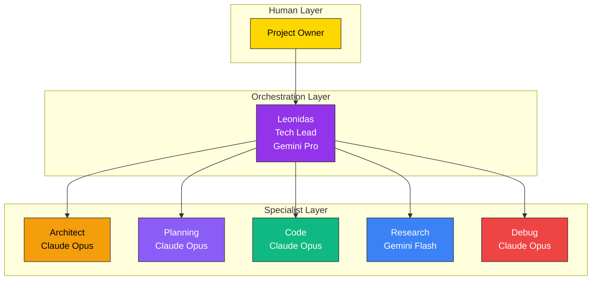
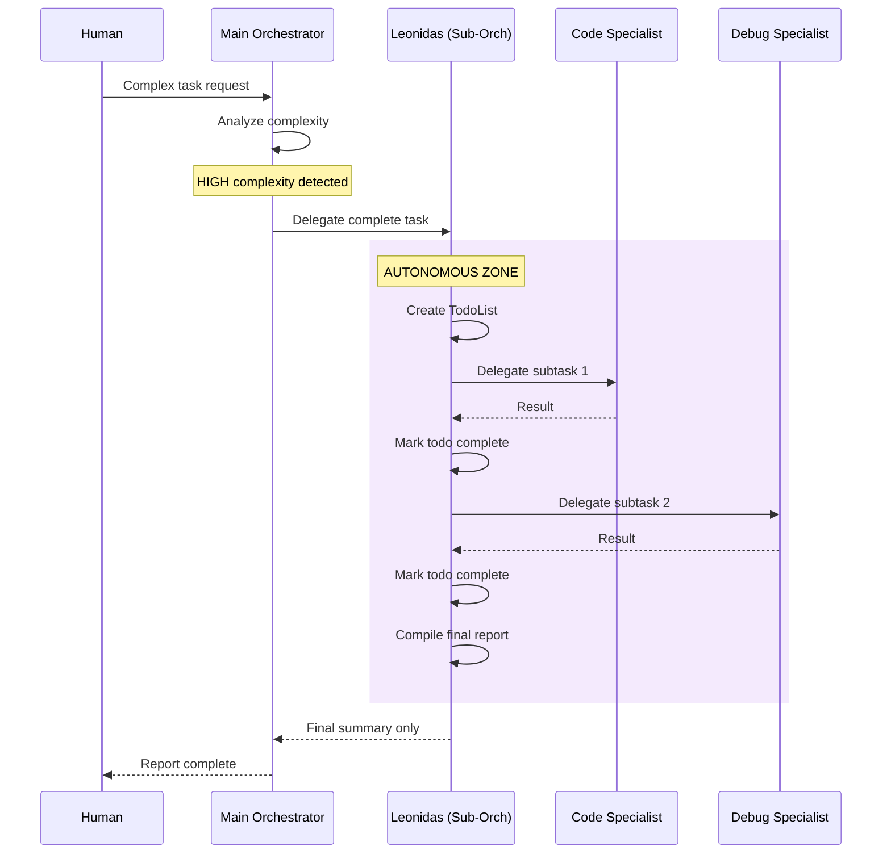
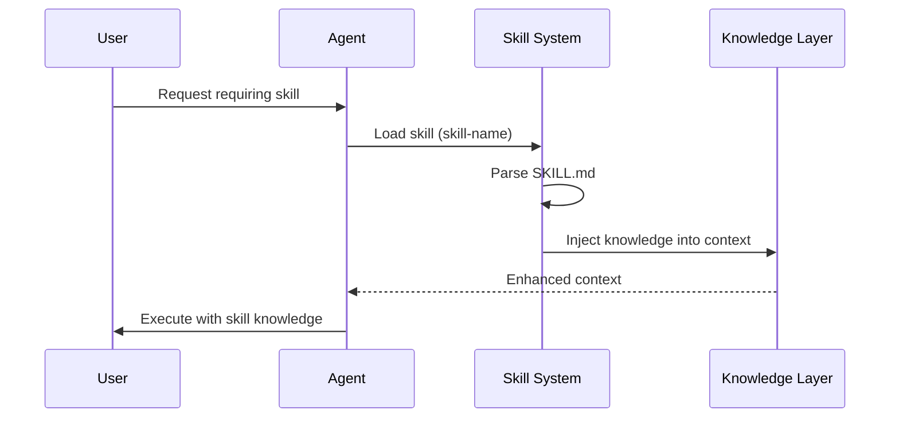
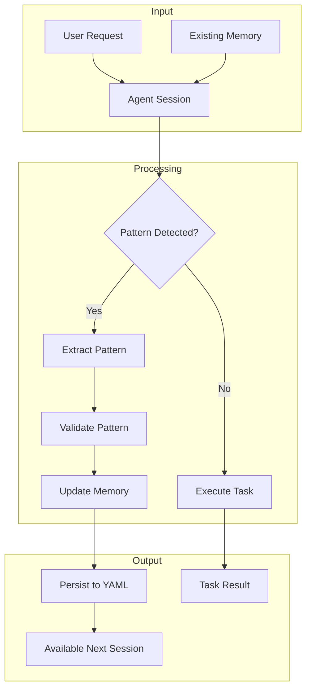
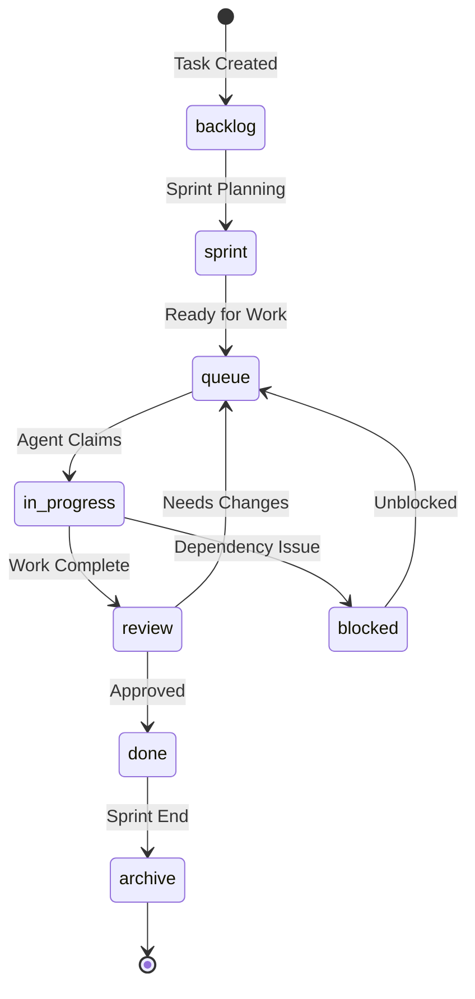
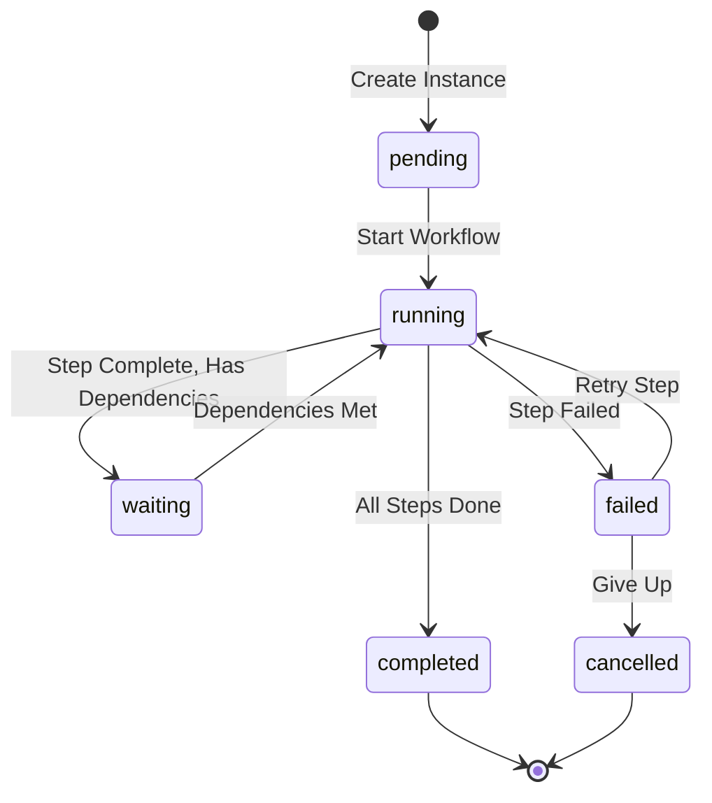
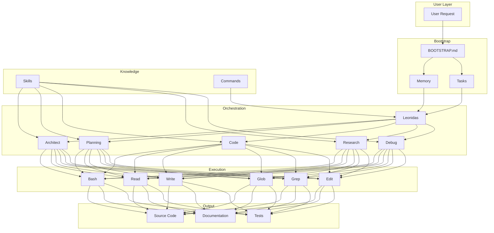
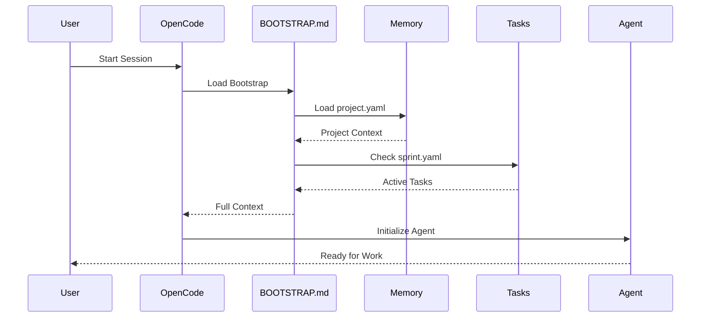

# OpenCode System Architecture

<!-- @META: Full System Architecture -->
<!--
    File: .opencode/specs/OPENCODE_ARCHITECTURE.md
    Version: 2.0.0
    Created: 2026-01-06
    Updated: 2026-01-07
    Scope: Complete architecture of the OpenCode agent orchestration system
-->

<!-- @NOTE(arch-001): Scope -->
> Comprehensive architecture documentation for the OpenCode agent orchestration system.

---

## Table of Contents

1. [System Overview](#1-system-overview)
2. [Agent Architecture](#2-agent-architecture)
3. [Hierarchical Orchestration](#3-hierarchical-orchestration)
4. [Skill System](#4-skill-system)
5. [Memory System](#5-memory-system)
6. [Task System](#6-task-system)
7. [Workflow Engine](#7-workflow-engine)
8. [Integration Layer](#8-integration-layer)
9. [Data Flow](#9-data-flow)

---

## 1. System Overview

### 1.1 Purpose

<!-- @NOTE(sys-001): Purpose -->
The OpenCode system provides an **AI-powered development environment** that:
- Orchestrates multiple specialized agents for different task types
- Maintains persistent project knowledge across sessions
- Manages work items through a structured task lifecycle
- Enables complex multi-step workflows with proper delegation

### 1.2 High-Level Architecture

<!-- @SCHEMA: Architecture Diagram -->
```
┌─────────────────────────────────────────────────────────────────────┐
│                         USER INTERFACE                               │
│                    (OpenCode CLI / Terminal)                         │
└─────────────────────────────────────────────────────────────────────┘
                                  │
                                  ▼
┌─────────────────────────────────────────────────────────────────────┐
│                      ORCHESTRATION LAYER                             │
│  ┌─────────────────────────────────────────────────────────────┐    │
│  │                    Leonidas (Tech Lead)                      │    │
│  │          Gemini Pro - 1M context - Full visibility           │    │
│  └─────────────────────────────────────────────────────────────┘    │
│                                  │                                   │
│         ┌────────────────────────┼────────────────────────┐         │
│         ▼                        ▼                        ▼         │
│  ┌─────────────┐          ┌─────────────┐          ┌─────────────┐  │
│  │  Planning   │          │    Code     │          │  Research   │  │
│  │ Claude Opus │          │ Claude Opus │          │ Gemini Flash│  │
│  └─────────────┘          └─────────────┘          └─────────────┘  │
│         │                        │                        │         │
│  ┌─────────────┐          ┌─────────────┐                          │
│  │  Architect  │          │    Debug    │                          │
│  │ Claude Opus │          │ Claude Opus │                          │
│  └─────────────┘          └─────────────┘                          │
└─────────────────────────────────────────────────────────────────────┘
                                  │
                                  ▼
┌─────────────────────────────────────────────────────────────────────┐
│                       KNOWLEDGE LAYER                                │
│  ┌────────────┐    ┌────────────┐    ┌────────────┐                 │
│  │   Memory   │    │   Skills   │    │   Tasks    │                 │
│  │  project   │    │  loaded    │    │   queue    │                 │
│  │  patterns  │    │ knowledge  │    │  sprints   │                 │
│  └────────────┘    └────────────┘    └────────────┘                 │
└─────────────────────────────────────────────────────────────────────┘
                                  │
                                  ▼
┌─────────────────────────────────────────────────────────────────────┐
│                        EXECUTION LAYER                               │
│  ┌────────────┐    ┌────────────┐    ┌────────────┐                 │
│  │    Bash    │    │    Read    │    │   Write    │                 │
│  │   (shell)  │    │   (files)  │    │  (files)   │                 │
│  └────────────┘    └────────────┘    └────────────┘                 │
│  ┌────────────┐    ┌────────────┐    ┌────────────┐                 │
│  │    Glob    │    │    Grep    │    │    Edit    │                 │
│  │  (search)  │    │ (content)  │    │ (modify)   │                 │
│  └────────────┘    └────────────┘    └────────────┘                 │
│  ┌────────────┐    ┌────────────┐    ┌────────────┐                 │
│  │  WebFetch  │    │   Skill    │    │    Task    │                 │
│  │  (internet)│    │  (load)    │    │ (delegate) │                 │
│  └────────────┘    └────────────┘    └────────────┘                 │
└─────────────────────────────────────────────────────────────────────┘
```

### 1.3 Design Principles

<!-- @NOTE(sys-002): Principles -->
| Principle | Description | Implementation |
|-----------|-------------|----------------|
| **Specialization** | Each agent excels at specific tasks | 6 specialist agents + 1 orchestrator |
| **Delegation** | Work flows to the right specialist | Leonidas routes to appropriate agent |
| **Persistence** | Knowledge survives sessions | Memory system with YAML files |
| **Modularity** | Skills are loadable knowledge units | Skill system with SKILL.md files |
| **Atomicity** | Tasks are discrete, completable units | <50 interactions per task |

---

## 2. Agent Architecture

### 2.1 Agent Hierarchy

<!-- @REF(.opencode/agents/README.md): Agent Definitions -->


### 2.2 Agent Specifications

<!-- @NOTE(agent-001): Specs -->
| Agent | Model | Role | Output |
|-------|-------|------|--------|
| **Orchestrator** | Claude Opus | Main thread, human interface, parallel coordination | Consolidated reports, strategic decisions |
| **Leonidas** | Gemini Pro | Autonomous sub-orchestrator, project execution | Delegation briefs, completed deliverables |
| **Architect** | Claude Opus | System design, specifications | .md files only, Mermaid diagrams |
| **Planning** | Claude Opus | RFCs, decomposition, roadmaps | Plans, RFCs, task breakdowns |
| **Code** | Claude Opus | Implementation, testing | Source code, tests |
| **Research** | Gemini Flash | Investigation, discovery | Research reports, findings |
| **Debug** | Claude Opus | Root cause analysis, fixes | Bug fixes with tests |

### 2.3 Agent Files Location

<!-- @REF(.opencode/agent/): Agent Definitions -->
```
.opencode/agent/
├── orchestrator.md  # Main Thread - Human Interface (NEW)
├── leonidas.md      # Autonomous Sub-Orchestrator
├── architect.md     # System Architect  
├── planning.md      # Strategic Planner
├── code.md          # Implementation Engineer
├── research.md      # Research Analyst
└── debug.md         # Debug Specialist
```

### 2.4 Three-Tier Hierarchy

<!-- @NOTE(hierarchy): New Three-Tier Model -->
```
┌─────────────────────────────────────────────────────────────────────┐
│                    TIER 1: HUMAN INTERFACE                           │
│                                                                       │
│                    ┌─────────────────────────┐                       │
│                    │      ORCHESTRATOR       │                       │
│                    │    (Genesis/Main)       │                       │
│                    │                         │                       │
│                    │  • Talks to human       │                       │
│                    │  • Strategic decisions  │                       │
│                    │  • Parallel decompose   │                       │
│                    │  • Result consolidation │                       │
│                    └───────────┬─────────────┘                       │
└────────────────────────────────┼────────────────────────────────────┘
                                 │
                    PARALLEL DELEGATION (SOP-003)
                    [Multiple Task calls in single message]
                                 │
┌────────────────────────────────┼────────────────────────────────────┐
│                    TIER 2: SUB-ORCHESTRATION                         │
│                                                                       │
│         ┌──────────────────────┼──────────────────────┐              │
│         ▼                      ▼                      ▼              │
│  ┌─────────────┐        ┌─────────────┐        ┌─────────────┐       │
│  │  LEONIDAS   │        │  LEONIDAS   │        │  LEONIDAS   │       │
│  │ Instance 1  │        │ Instance 2  │        │ Instance 3  │       │
│  │             │        │             │        │             │       │
│  │ • TodoWrite │        │ • TodoWrite │        │ • TodoWrite │       │
│  │ • Autonomy  │        │ • Autonomy  │        │ • Autonomy  │       │
│  │ • Delegates │        │ • Delegates │        │ • Delegates │       │
│  └──────┬──────┘        └──────┬──────┘        └──────┬──────┘       │
└─────────┼──────────────────────┼──────────────────────┼─────────────┘
          │                      │                      │
┌─────────┼──────────────────────┼──────────────────────┼─────────────┐
│         │       TIER 3: SPECIALIST EXECUTION         │              │
│         ▼                      ▼                      ▼              │
│  ┌─────────────┐        ┌─────────────┐        ┌─────────────┐       │
│  │  Architect  │        │    Code     │        │  Research   │       │
│  │  Planning   │        │   Debug     │        │             │       │
│  └─────────────┘        └─────────────┘        └─────────────┘       │
└─────────────────────────────────────────────────────────────────────┘
```

### 2.5 Delegation Protocol

<!-- @RULE: Delegation Format -->
When Leonidas delegates to a specialist, this format MUST be used:

```markdown
## CONTEXT
- Overall Goal: [Parent objective]
- Current Phase: [Phase in master plan]
- Completed So Far: [Summary]
- Dependencies Met: [Prerequisites]

## OBJECTIVE
[Single clear mission]

## SCOPE
MUST do:
- [Requirement 1]
- [Requirement 2]

MUST NOT do:
- [Forbidden scope]

## CONSTRAINTS
- Architecture: [Patterns to follow]
- Technology: [Versions, libs]
- Quality: [Standards required]

## SUCCESS CRITERIA
- [ ] [Criterion 1]
- [ ] [Criterion 2]

## DELIVERABLES
- [Expected outputs]
```

---

## 3. Hierarchical Orchestration

### 3.1 Two-Tier Architecture

<!-- @NOTE(orch-001): Sub-Orchestrator Model -->
The OpenCode system uses a **two-tier orchestration model** where the main orchestrator (OpenCode main thread) delegates complete tasks to sub-orchestrators (Leonidas) who have full autonomy.

```
┌─────────────────────────────────────────────────────────────────────┐
│                    MAIN ORCHESTRATOR (OpenCode)                      │
│  Responsibilities:                                                   │
│  - Direct communication with human                                   │
│  - High-level strategic decisions                                    │
│  - Task delegation to sub-orchestrators                              │
│  - Final result integration                                          │
│                                                                       │
│  DOES NOT: Execute tasks directly, manage subtasks, implement code   │
└───────────────────────────────────┬─────────────────────────────────┘
                                    │
                    FULL TASK DELEGATION
                      (self-contained)
                                    │
            ┌───────────────────────┼───────────────────────┐
            ▼                       ▼                       ▼
┌───────────────────────┐ ┌───────────────────────┐ ┌───────────────────────┐
│  SUB-ORCHESTRATOR A   │ │  SUB-ORCHESTRATOR B   │ │  SUB-ORCHESTRATOR C   │
│     (Leonidas)        │ │     (Leonidas)        │ │     (Leonidas)        │
│                       │ │                       │ │                       │
│ - Own TodoList        │ │ - Own TodoList        │ │ - Own TodoList        │
│ - Full autonomy       │ │ - Full autonomy       │ │ - Full autonomy       │
│ - Delegates to specs  │ │ - Delegates to specs  │ │ - Delegates to specs  │
│ - Reports only final  │ │ - Reports only final  │ │ - Reports only final  │
└───────────┬───────────┘ └───────────┬───────────┘ └───────────┬───────────┘
            │                         │                         │
    ┌───────┴───────┐         ┌───────┴───────┐         ┌───────┴───────┐
    ▼       ▼       ▼         ▼       ▼       ▼         ▼       ▼       ▼
  Code   Debug  Research   Code   Arch   Code       Research  Code  Arch
```

### 3.2 Sub-Orchestrator (Leonidas) Capabilities

<!-- @NOTE(orch-002): Tools -->
Leonidas operates as a **fully autonomous sub-orchestrator** with the following capabilities:

| Tool | Purpose | Usage |
|------|---------|-------|
| **TodoWrite** | Create and manage own task list | Break down delegated task into subtasks |
| **TodoRead** | Check pending tasks | Monitor progress |
| **Task** | Delegate to specialist agents | Invoke architect, code, debug, research |
| **Bash** | Execute shell commands | Build, test, lint |
| **Read/Write/Edit** | File operations | Modify source code |
| **Glob/Grep** | File search | Find relevant files |

### 3.3 Delegation Flow

<!-- @SCHEMA: Delegation Sequence -->


### 3.4 Delegation Threshold

<!-- @RULE: Delegation Criteria -->
The main orchestrator uses these criteria to decide whether to delegate to a sub-orchestrator:

| Criteria | Delegate to Leonidas | Execute Directly |
|----------|---------------------|------------------|
| Task complexity | HIGH | LOW/MEDIUM |
| Estimated duration | > 30 minutes | < 30 minutes |
| Files affected | > 10 files | < 10 files |
| Cross-module changes | Yes | No |
| Requires planning | Yes | No |
| Multi-phase work | Yes | No |

### 3.5 Sub-Orchestrator Invocation Pattern

<!-- @SCHEMA: Invocation Template -->
When the main orchestrator needs to delegate:

```javascript
Task({
  description: "Complete [task name]",
  subagent_type: "leonidas",
  prompt: `
## LEONIDAS MISSION: [Task Name]

### CONTEXT
[Complete context about the task]

### OBJECTIVE
[Single clear deliverable]

### SUCCESS CRITERIA
- [ ] [Criterion 1]
- [ ] [Criterion 2]

### FILES IN SCOPE
- path/to/module/**/*

### CONSTRAINTS
- Follow existing patterns
- Add tests for new code
- Update documentation

### AUTONOMY GRANT
You have FULL AUTONOMY to complete this task:
1. Create your own TodoList using TodoWrite
2. Delegate to specialist agents
3. Make all implementation decisions
4. Report ONLY the final summary when complete

DO NOT:
- Ask clarifying questions
- Report intermediate progress
- Request approval for decisions
`
})
```

### 3.6 Key Principles

<!-- @RULE: Orchestration Principles -->
1. **Single Responsibility**
   - Main orchestrator: Human communication, strategic decisions
   - Sub-orchestrator: Task execution, tactical decisions

2. **Full Autonomy**
   - Sub-orchestrators have complete authority over their task
   - They make decisions without asking permission
   - They only report at the end

3. **TodoList Ownership**
   - Each sub-orchestrator maintains its own TodoList
   - Tracks subtasks independently
   - Marks completion as work progresses

4. **Parallel Execution**
   - Multiple Leonidas instances can run in parallel
   - Each handles an independent task
   - Main orchestrator integrates results

5. **No Blocking**
   - Sub-orchestrators never pause for approval
   - They make reasonable decisions
   - They document decisions in final report

---

## 4. Skill System

### 4.1 Skill Concept

<!-- @NOTE(skill-001): Definition -->
Skills are **loadable knowledge modules** that provide specialized guidance for specific task types. They act as compressed expertise that agents can invoke.

### 4.2 Skill Structure

<!-- @REF(.opencode/skill/): Skill Directory -->
```
.opencode/skill/{skill-name}/
├── SKILL.md           # Entry point (required)
├── *.md               # Additional documentation
├── docs/              # Deep-dive documentation
├── templates/         # Reusable templates
└── examples/          # Concrete examples
```

### 4.3 SKILL.md Format

<!-- @SCHEMA: Skill Definition -->
```yaml
---
name: skill-name
description: What this skill provides
version: 1.0.0
---

# Skill Title

## Purpose
[What this skill helps with]

## When to Use
[Triggers for loading this skill]

## Core Knowledge
[The actual skill content]

## Related Skills
[Links to complementary skills]
```

### 4.4 Available Skills

<!-- @REF(.opencode/skill/): Skills List -->
| Skill | Purpose | Location |
|-------|---------|----------|
| `opencode-specs` | OpenCode engine documentation | `.opencode/skill/opencode-specs/` |
| `code-review` | Code review methodology | `.opencode/skill/code-review/` |
| `rfc-creation` | RFC writing guide | `.opencode/skill/rfc-creation/` |
| `task-decomposition` | Breaking down initiatives | `.opencode/skill/task-decomposition/` |
| `codebase-analysis` | Analyzing unfamiliar code | `.opencode/skill/codebase-analysis/` |

### 4.5 Skill Loading Flow

<!-- @SCHEMA: Skill Sequence -->


---

## 5. Memory System

### 5.1 Memory Purpose

<!-- @NOTE(mem-001): Purpose -->
Memory provides **persistent project knowledge** that survives across sessions:
- Project structure and relationships
- Learned patterns and preferences
- Architectural decisions
- Anti-patterns to avoid

### 5.2 Memory Files

<!-- @REF(.opencode/memory/): Memory Directory -->
```
.opencode/memory/
├── README.md          # Memory system documentation
├── project.yaml       # Core project metadata
├── patterns.yaml      # Learned patterns (future)
└── architecture.md    # Condensed architecture (future)
```

### 5.3 Project Memory Schema

<!-- @SCHEMA: Project Memory -->
```yaml
project:
  name: string           # Project identifier
  description: string    # One-line description
  owner: string          # Primary stakeholder
  repository: path       # Absolute path

structure:
  frontend: string       # Frontend package
  backend: string        # Backend package
  agents: string         # Agent config path

relationships:
  - from: string         # Source component
    to: string           # Target component
    type: string         # depends|extends|uses

technologies:
  frontend: [string]     # Frontend stack
  backend: [string]      # Backend stack
  agents: [string]       # AI technologies
```

### 5.4 Memory Flow



---

## 6. Task System

### 6.1 Task Lifecycle

<!-- @SCHEMA: Task States -->


### 6.2 Task Files

<!-- @REF(.opencode/tasks/): Task Directory -->
```
.opencode/tasks/
├── README.md           # Task system documentation
├── backlog.yaml        # All pending work (future)
├── sprint.yaml         # Current sprint tasks
├── queue/              # Tasks ready for execution
│   └── TASK-001.yaml   # Individual task files
└── archive/            # Completed task history
    └── 2026-01/        # Monthly archives
```

### 6.3 Task Schema

<!-- @SCHEMA: Task Definition -->
```yaml
task:
  id: "TASK-001"              # Unique identifier
  title: "Short description"   # Max 80 chars
  status: "pending"           # Current state
  priority: "medium"          # critical|high|medium|low
  
  type: "feature"             # feature|bugfix|refactor|docs|test
  component: "kernel"         # Affected component
  
  assignee: "code"            # Agent ID
  blocked_by: ["TASK-002"]    # Dependencies
  
  progress: 0                 # 0-100
  estimated_hours: 4          # Time estimate
  
  created: "2026-01-06"       # Timestamps
  started: null
  completed: null
```

### 6.4 Agent-Task Mapping

<!-- @NOTE(task-001): Mapping -->
| Agent | Task Types | Capabilities |
|-------|------------|--------------|
| `architect` | feature, refactor | Specs only, no code |
| `code` | feature, bugfix, refactor, test | Implementation |
| `research` | docs, chore | Information gathering |
| `debug` | bugfix | Problem diagnosis |
| `planning` | All types | Task decomposition |

---

## 7. Workflow Engine

### 7.1 Workflow Concept

<!-- @NOTE(wf-001): Definition -->
Workflows are **structured sequences of agent activities** that accomplish complex goals through coordinated steps.

### 7.2 Workflow Structure

<!-- @REF(.opencode/workflows/): Workflow Directory -->
```
.opencode/workflows/
├── definitions/        # Workflow templates
│   └── *.yaml         # Workflow definitions
└── instances/          # Active workflow runs
    └── *.yaml         # Running instances
```

### 7.3 Workflow Definition Schema

<!-- @SCHEMA: Workflow Definition -->
```yaml
workflow:
  id: "WF-001"
  name: "Feature Development"
  description: "End-to-end feature implementation"
  
steps:
  - id: "step-1"
    name: "Design"
    agent: "architect"
    inputs: ["requirements"]
    outputs: ["spec"]
    
  - id: "step-2"
    name: "Plan"
    agent: "planning"
    inputs: ["spec"]
    outputs: ["tasks"]
    depends_on: ["step-1"]
    
  - id: "step-3"
    name: "Implement"
    agent: "code"
    inputs: ["spec", "tasks"]
    outputs: ["code", "tests"]
    depends_on: ["step-2"]
```

### 7.4 Workflow State Machine

<!-- @SCHEMA: Workflow States -->


---

## 8. Integration Layer

### 8.1 MCP (Model Context Protocol)

<!-- @REF(.opencode/integrations/mcp/): MCP Configs -->
```
.opencode/integrations/mcp/
└── servers.yaml        # MCP server configurations
```
Enables connection to external tools and services through standardized protocol.

### 8.2 Webhooks

<!-- @REF(.opencode/integrations/webhooks/): Webhooks Config -->
```
.opencode/integrations/webhooks/
└── config.yaml         # Outbound webhook definitions
```
For notifications and external system integration.

### 8.3 Command System

<!-- @REF(.opencode/command/): Slash Commands -->
```
.opencode/command/
├── analyze.md          # /analyze command
├── review.md           # /review command
├── decompose.md        # /decompose command
└── rfc.md              # /rfc command
```
Slash commands that trigger specific agent workflows.

---

## 9. Data Flow

### 9.1 Complete System Flow

<!-- @SCHEMA: System Data Flow -->


### 9.2 Session Initialization Flow

<!-- @SCHEMA: Session Init Flow -->


---

## Appendix A: File Reference

<!-- @NOTE(ref-001): File Types -->
| File | Purpose | Format |
|------|---------|--------|
| `BOOTSTRAP.md` | Session initialization | Markdown |
| `agent/*.md` | Agent definitions | Markdown with YAML frontmatter |
| `skill/*/SKILL.md` | Skill entry points | Markdown with YAML frontmatter |
| `memory/project.yaml` | Project metadata | YAML |
| `tasks/sprint.yaml` | Current sprint | YAML |
| `tasks/queue/*.yaml` | Individual tasks | YAML |
| `command/*.md` | Slash commands | Markdown |

---

## Version History

| Version | Date | Changes |
|---------|------|---------|
| 2.0.0 | 2026-01-07 | Full semantic audit and standardization |
| 1.1.0 | 2026-01-07 | Added Hierarchical Orchestration section |
| 1.0.0 | 2026-01-06 | Initial architecture document |
