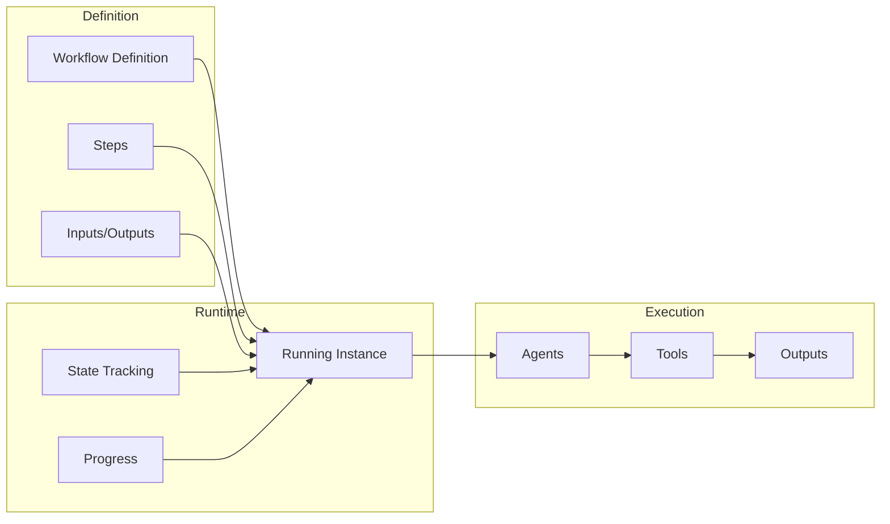
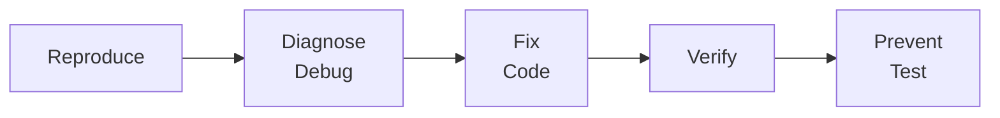
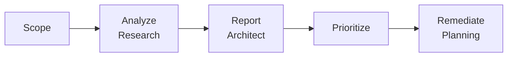
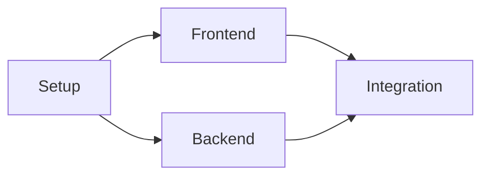
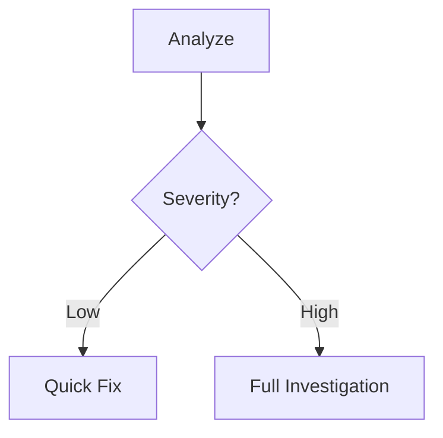
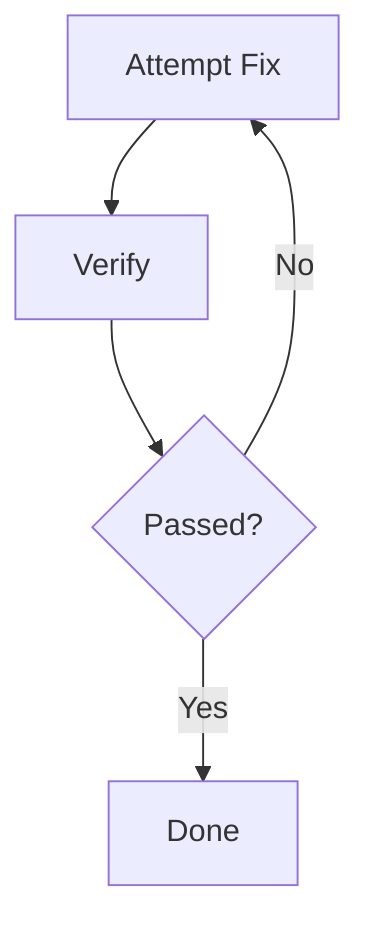

# Workflow Patterns Documentation

<!--
    File: .opencode/specs/WORKFLOW_PATTERNS.md
    Version: 1.0.0
    Created: 2026-01-06
    Scope: Workflow patterns and usage guide
-->

> Guide to understanding and customizing OpenCode workflow patterns.

---

## Table of Contents

1. [Overview](#1-overview)
2. [Workflow Types](#2-workflow-types)
3. [Common Patterns](#3-common-patterns)
4. [Customization Guide](#4-customization-guide)
5. [Examples](#5-examples)

---

## 1. Overview

### 1.1 What is a Workflow?

A workflow is a **structured sequence of agent activities** that:
- Accomplishes a complex goal through coordinated steps
- Manages dependencies between steps
- Tracks state across the entire process
- Enables parallel execution where possible

### 1.2 Workflow Components



### 1.3 Workflow Directory Structure

```
.opencode/workflows/
├── definitions/           # Workflow templates
│   ├── feature.yaml       # Feature development workflow
│   ├── bugfix.yaml        # Bug fix workflow
│   ├── rfc.yaml           # RFC creation workflow
│   └── audit.yaml         # Code audit workflow
│
└── instances/             # Active workflow runs
    ├── WF-2026-001.yaml   # Running instance
    └── WF-2026-002.yaml   # Another instance
```

---

## 2. Workflow Types

### 2.1 Feature Development Workflow

**Purpose**: End-to-end implementation of a new feature

**Stages**:
1. **Design** → Architect creates specification
2. **Plan** → Planning agent breaks down into tasks
3. **Implement** → Code agent implements each task
4. **Test** → Code agent writes tests
5. **Review** → Validation and quality check


### 2.2 Bug Fix Workflow

**Purpose**: Systematic diagnosis and resolution of bugs

**Stages**:
1. **Reproduce** → Confirm the bug exists
2. **Diagnose** → Debug agent finds root cause
3. **Fix** → Code agent implements fix
4. **Verify** → Confirm fix works
5. **Prevent** → Add regression test



### 2.3 RFC Workflow

**Purpose**: Create a formal Request for Comments document

**Stages**:
1. **Research** → Gather context and alternatives
2. **Draft** → Create initial RFC
3. **Review** → Internal review cycle
4. **Finalize** → Incorporate feedback
5. **Publish** → Move to official RFC location


### 2.4 Code Audit Workflow

**Purpose**: Comprehensive quality assessment

**Stages**:
1. **Scope** → Define audit boundaries
2. **Analyze** → Automated and manual analysis
3. **Report** → Document findings
4. **Prioritize** → Rank issues by severity
5. **Remediate** → Create fix tasks



---

## 3. Common Patterns

### 3.1 Sequential Pattern

Steps execute one after another in strict order.

```yaml
workflow:
  name: "Sequential Example"
  
steps:
  - id: "step-1"
    name: "First"
    agent: "architect"
    
  - id: "step-2"
    name: "Second"
    depends_on: ["step-1"]
    agent: "code"
    
  - id: "step-3"
    name: "Third"
    depends_on: ["step-2"]
    agent: "code"
```


### 3.2 Parallel Pattern

Independent steps execute simultaneously.

```yaml
workflow:
  name: "Parallel Example"
  
steps:
  - id: "step-1"
    name: "Setup"
    agent: "planning"
    
  - id: "step-2a"
    name: "Frontend"
    depends_on: ["step-1"]
    agent: "code"
    
  - id: "step-2b"
    name: "Backend"
    depends_on: ["step-1"]
    agent: "code"
    
  - id: "step-3"
    name: "Integration"
    depends_on: ["step-2a", "step-2b"]
    agent: "code"
```



### 3.3 Conditional Pattern

Steps execute based on conditions.

```yaml
workflow:
  name: "Conditional Example"
  
steps:
  - id: "analyze"
    name: "Analyze Issue"
    agent: "debug"
    outputs: ["severity"]
    
  - id: "quick-fix"
    name: "Quick Fix"
    depends_on: ["analyze"]
    condition: "severity == 'low'"
    agent: "code"
    
  - id: "full-investigation"
    name: "Full Investigation"
    depends_on: ["analyze"]
    condition: "severity == 'high'"
    agent: "debug"
```



### 3.4 Loop Pattern

Repeat steps until condition met.

```yaml
workflow:
  name: "Loop Example"
  
steps:
  - id: "attempt"
    name: "Attempt Fix"
    agent: "code"
    outputs: ["result"]
    max_iterations: 3
    
  - id: "verify"
    name: "Verify Fix"
    depends_on: ["attempt"]
    agent: "debug"
    outputs: ["passed"]
    
  - id: "retry"
    name: "Retry"
    depends_on: ["verify"]
    condition: "passed == false"
    goto: "attempt"
```



---

## 4. Customization Guide

### 4.1 Creating a New Workflow

1. **Create definition file** in `.opencode/workflows/definitions/`

```yaml
# .opencode/workflows/definitions/my-workflow.yaml
workflow:
  id: "my-workflow"
  name: "My Custom Workflow"
  description: "Description of what this workflow does"
  version: "1.0.0"
  
inputs:
  - name: "requirement"
    type: "string"
    required: true
    description: "The main requirement to implement"
    
outputs:
  - name: "deliverables"
    type: "list"
    description: "Files created by this workflow"

steps:
  - id: "step-1"
    name: "First Step"
    agent: "architect"
    inputs: ["requirement"]
    outputs: ["spec"]
    
  - id: "step-2"
    name: "Second Step"
    agent: "code"
    inputs: ["spec"]
    outputs: ["code"]
    depends_on: ["step-1"]
```

### 4.2 Step Configuration

Each step supports these properties:

| Property | Type | Description |
|----------|------|-------------|
| `id` | string | Unique step identifier |
| `name` | string | Human-readable name |
| `agent` | string | Agent to execute (architect, code, etc.) |
| `inputs` | list | Required inputs from prior steps |
| `outputs` | list | Values produced by this step |
| `depends_on` | list | Step IDs that must complete first |
| `condition` | string | Expression that must be true to run |
| `timeout` | duration | Maximum time for step |
| `retry` | object | Retry configuration |
| `on_failure` | string | Step to run on failure |

### 4.3 Input/Output Types

| Type | Description | Example |
|------|-------------|---------|
| `string` | Text value | "Feature description" |
| `file` | File path | "docs/spec.md" |
| `list` | Array of values | ["file1.ts", "file2.ts"] |
| `object` | Structured data | `{name: "...", type: "..."}` |
| `boolean` | True/false | true |

### 4.4 Workflow Variables

Access data between steps:

```yaml
steps:
  - id: "analyze"
    outputs: ["file_count", "complexity"]
    
  - id: "decide"
    condition: "${analyze.file_count} > 10"
    
  - id: "report"
    template: |
      Found ${analyze.file_count} files
      Complexity: ${analyze.complexity}
```

---

## 5. Examples

### 5.1 Complete Feature Workflow

```yaml
# .opencode/workflows/definitions/feature.yaml
workflow:
  id: "feature"
  name: "Feature Development"
  description: "End-to-end feature implementation with full testing"
  version: "1.0.0"

inputs:
  - name: "requirement"
    type: "string"
    required: true
  - name: "component"
    type: "string"
    required: true

outputs:
  - name: "spec_file"
    type: "file"
  - name: "source_files"
    type: "list"
  - name: "test_files"
    type: "list"

steps:
  # Phase 1: Design
  - id: "design"
    name: "Create Specification"
    agent: "architect"
    inputs: ["requirement", "component"]
    outputs: ["spec_file", "interfaces"]
    timeout: "30m"
    
  # Phase 2: Planning
  - id: "plan"
    name: "Create Implementation Plan"
    agent: "planning"
    inputs: ["spec_file"]
    outputs: ["tasks"]
    depends_on: ["design"]
    
  # Phase 3: Implementation (parallel)
  - id: "implement-core"
    name: "Implement Core Logic"
    agent: "code"
    inputs: ["spec_file", "interfaces"]
    outputs: ["core_files"]
    depends_on: ["plan"]
    
  - id: "implement-tests"
    name: "Implement Tests"
    agent: "code"
    inputs: ["spec_file", "interfaces"]
    outputs: ["test_files"]
    depends_on: ["plan"]
    
  # Phase 4: Integration
  - id: "integrate"
    name: "Integrate Components"
    agent: "code"
    inputs: ["core_files", "test_files"]
    outputs: ["source_files"]
    depends_on: ["implement-core", "implement-tests"]
    
  # Phase 5: Verification
  - id: "verify"
    name: "Run Tests and Lint"
    agent: "code"
    inputs: ["source_files", "test_files"]
    outputs: ["test_results", "lint_results"]
    depends_on: ["integrate"]
    
  # Phase 6: Review
  - id: "review"
    name: "Final Review"
    agent: "architect"
    inputs: ["spec_file", "source_files", "test_results"]
    outputs: ["review_report"]
    depends_on: ["verify"]
    condition: "${verify.test_results.passed} == true"
```

### 5.2 Workflow Instance

Running instance of the feature workflow:

```yaml
# .opencode/workflows/instances/WF-2026-001.yaml
instance:
  id: "WF-2026-001"
  workflow: "feature"
  status: "running"
  created: "2026-01-06T10:00:00Z"
  
inputs:
  requirement: "Add dark mode toggle to settings panel"
  component: "system52/settings"
  
current_step: "implement-core"
completed_steps:
  - id: "design"
    completed: "2026-01-06T10:30:00Z"
    outputs:
      spec_file: "docs/specs/dark-mode-toggle.md"
      interfaces: ["DarkModeToggle", "ThemePreference"]
      
  - id: "plan"
    completed: "2026-01-06T10:45:00Z"
    outputs:
      tasks: ["TASK-101", "TASK-102", "TASK-103"]

step_status:
  design: "completed"
  plan: "completed"
  implement-core: "in_progress"
  implement-tests: "pending"
  integrate: "pending"
  verify: "pending"
  review: "pending"
```

### 5.3 Bug Fix Workflow

```yaml
# .opencode/workflows/definitions/bugfix.yaml
workflow:
  id: "bugfix"
  name: "Bug Fix"
  description: "Systematic bug diagnosis and resolution"
  version: "1.0.0"

inputs:
  - name: "bug_report"
    type: "string"
    required: true
  - name: "affected_component"
    type: "string"
    required: true

steps:
  - id: "reproduce"
    name: "Reproduce Bug"
    agent: "debug"
    inputs: ["bug_report"]
    outputs: ["reproduction_steps", "confirmed"]
    
  - id: "diagnose"
    name: "Root Cause Analysis"
    agent: "debug"
    inputs: ["reproduction_steps", "affected_component"]
    outputs: ["root_cause", "affected_files"]
    depends_on: ["reproduce"]
    condition: "${reproduce.confirmed} == true"
    
  - id: "fix"
    name: "Implement Fix"
    agent: "code"
    inputs: ["root_cause", "affected_files"]
    outputs: ["fix_files"]
    depends_on: ["diagnose"]
    
  - id: "test"
    name: "Add Regression Test"
    agent: "code"
    inputs: ["reproduction_steps", "fix_files"]
    outputs: ["test_files"]
    depends_on: ["fix"]
    
  - id: "verify"
    name: "Verify Fix"
    agent: "debug"
    inputs: ["reproduction_steps", "fix_files", "test_files"]
    outputs: ["verified"]
    depends_on: ["test"]
    retry:
      max_attempts: 2
      on_failure: "diagnose"
```

---

## Best Practices

### Do's

- **Keep steps atomic** - Each step should have a single clear purpose
- **Define clear inputs/outputs** - Makes data flow explicit
- **Use parallel execution** - Where steps are independent
- **Add timeouts** - Prevent runaway steps
- **Include verification** - Always verify work before completion

### Don'ts

- **Don't create mega-steps** - Break large work into smaller steps
- **Don't skip dependencies** - Respect the dependency graph
- **Don't hardcode values** - Use inputs and variables
- **Don't ignore failures** - Configure proper failure handling

---

## Version History

| Version | Date | Changes |
|---------|------|---------|
| 1.0.0 | 2026-01-06 | Initial workflow documentation |
