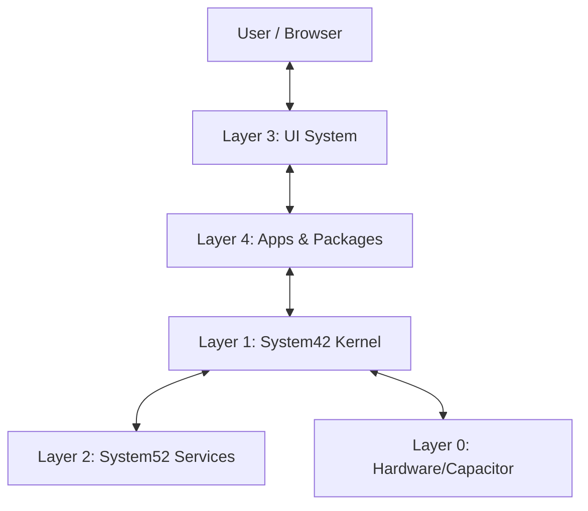

# vibeos-react Architecture Map

<!-- @META: Frontend Architecture Documentation -->
<!--
    File: .opencode/specs/architecture/VIBEOS_REACT_ARCHITECTURE.md
    Version: 2.0.0
    Created: 2026-01-07
    Updated: 2026-01-07
    Scope: vibeos-react package (Frontend OS)
-->

## 1. Architecture Overview

<!-- @NOTE(arch-001): Layered Architecture -->
The `vibeos-react` system implements a layered OS-in-Browser architecture, rigorously separating Kernel logic from UI presentation.

### Layer Definitions

| Layer | Component | Responsibility | Principles |
|-------|-----------|----------------|------------|
| **L0** | **Hardware Abstraction** | Browser APIs, Capacitor Plugins, FileSystem Access | Platform Agnostic |
| **L1** | **System42 (Kernel)** | Process Management, VFS, Security, Registry, Event Bus | No UI, Pure Logic |
| **L2** | **System52 (Services)** | Signaling, Authentication, Sync, WebRTC | Stateless, API-driven |
| **L3** | **UI System** | Window Manager, Desktop Shell, System Tray, Toasts | React-heavy, Visual |
| **L4** | **Applications** | User-facing programs (Browser, IDE, Chat) | Sandboxed, Pluggable |

---

## 2. Design Principles

<!-- @RULE: Architecture Standards -->

### Core Principles
1.  **Strict Separation of Concerns**: Kernel modules (`system42/*`) must NOT import UI components (`components/*`).
2.  **Event-Driven Communication**: Modules communicate via `SystemBus` rather than direct coupling where possible.
3.  **Dependency Inversion**: High-level policies (Kernel) define interfaces; low-level details (Adapters) implement them.
4.  **Immutability**: State updates should use immutable patterns (Redux/Context) to ensure predictability.

### SOLID Implementation
-   **SRP**: Each Service/Module has ONE clear responsibility (e.g., `Registry` only manages mappings).
-   **OCP**: The OS is open for extension (new Apps/Modules) but closed for modification (Core Kernel).
-   **LSP**: All `IStorageProvider` implementations must behave interchangeably.
-   **ISP**: Large interfaces are broken down (e.g., `IProcess` vs `IProcessRender`).
-   **DIP**: Services depend on abstractions, not concrete implementations.

---

## 3. Strategic Pillars

### State Management Strategy
<!-- @NOTE(strat-state): Hybrid Approach -->
-   **Global OS State**: React Context (`DesktopContext`, `OSContext`) for window management and UI theming.
-   **Process State**: `useReducer` or localized Stores for individual application logic.
-   **Kernel State**: Singleton Services (Classes) holding reactive state (Observables) for system-wide consistency.
-   **Server State**: React Query (TanStack Query) for `System52` data fetching and caching.

### Performance Strategy
<!-- @NOTE(strat-perf): Optimization Targets -->
-   **Code Splitting**: Dynamic imports (`React.lazy`) for ALL Apps and Heavy Packages.
-   **Virtualization**: Lists > 50 items use virtualization (react-window).
-   **Asset Optimization**: SVGs for icons, WebP for images.
-   **Lazy Initialization**: Kernel services initialize on-demand unless critical (Boot).
-   **Targets**:
    -   FCP (First Contentful Paint): < 1.5s
    -   TTI (Time to Interactive): < 3.0s
    -   Bundle Size (Core): < 500KB (gzipped)

### Security Model
<!-- @NOTE(strat-sec): Defense in Depth -->
1.  **Sandboxing**: Apps run in isolated contexts (conceptually) via `ProcessID`.
2.  **Path Validation**: `PathValidator` ensures no directory traversal attacks in VFS.
3.  **Content Security Policy (CSP)**: Strict script-src and connect-src.
4.  **Storage Encryption**: `SecureStorageService` encrypts sensitive keys (AES-256).
5.  **XSS Prevention**: React's auto-escaping + rigorous HTML sanitization for dynamic content.

### Testing Strategy
<!-- @NOTE(strat-test): Pyramid -->
-   **Unit Tests (Vitest)**: 80% coverage target for Kernel and Utils. `src/**/*.test.ts`.
-   **Integration Tests**: Verifying SystemBus and Service interactions.
-   **E2E Tests (Playwright)**: Critical flows (Boot, Login, App Launch).
-   **Snapshot Tests**: For UI Library components to catch regressions.

---

## 4. System42 (Kernel Layer) Analysis

<!-- @SOURCE(vibeos-react/system42): Kernel Source -->
<!-- @REF(vibeos-react/system42/kernel/AGENTS.md): Kernel Agents -->

### Core Kernel Modules

#### `kernel/registry.ts`
-   **Responsibility**: Central database of installed Apps, File Types (MIME), and System Capabilities.
-   **Dependencies**: `SystemBus`, `Logger`
-   **Exports**: `AppRegistryService` (Singleton)
-   **Complexity**: Medium
-   **Maturity**: **Stable**
-   **Coverage Target**: 90%

#### `kernel/systemBus.ts`
-   **Responsibility**: System-wide event emitter for decoupled communication (Pub/Sub).
-   **Dependencies**: None (Pure TS)
-   **Exports**: `SystemBus`, `EventTypes`
-   **Complexity**: High (Critical Path)
-   **Maturity**: **Mature**
-   **Coverage Target**: 100%

#### `filesystem/VirtualFileSystem.ts`
-   **Responsibility**: In-memory file system mimicking POSIX standards (read, write, chmod).
-   **Dependencies**: `PathValidator`, `StorageAdapter`
-   **Exports**: `VFS` (Singleton)
-   **Complexity**: Very High
-   **Maturity**: **Beta**
-   **Performance**: O(1) lookups, O(n) directory listing
-   **Coverage Target**: 95%

#### `process/process-utils.ts`
-   **Responsibility**: Lifecycle management of OS processes (PID generation, kill, spawn).
-   **Dependencies**: `Registry`, `VFS`
-   **Exports**: `ProcessManager`
-   **Complexity**: High
-   **Maturity**: **Beta**
-   **Coverage Target**: 85%

#### `security/SecureStorageService.ts`
-   **Responsibility**: AES-encrypted storage for auth tokens and sensitive user config.
-   **Dependencies**: `cryptoService`, `localStorage`/`IndexedDB`
-   **Exports**: `SecureStorage`
-   **Complexity**: Medium
-   **Maturity**: **Stable**
-   **Coverage Target**: 100%

#### `system42/ui/` (Design System)
-   **Responsibility**: Base UI components (Window, Button, Input) ensuring visual consistency.
-   **Dependencies**: `styled-components` / `emotion`, `React`
-   **Exports**: `WindowFrame`, `OSButton`, `SystemFont`
-   **Complexity**: Medium
-   **Maturity**: **Stable**
-   **Accessibility**: WCAG 2.1 AA Compliant

---

## 5. System52 (Services Layer) Analysis

<!-- @SOURCE(vibeos-react/system52): Services Source -->

#### `hub/HubClient.ts`
-   **Responsibility**: Managing WebSocket/WebRTC connections to the Backend Hub.
-   **Dependencies**: `socket.io-client`, `simple-peer`
-   **Exports**: `HubClient`
-   **Complexity**: High (Network volatility handling)
-   **Maturity**: **Alpha**
-   **Network**: Auto-reconnect enabled

#### `runtime/webContainerService.ts`
-   **Responsibility**: Interfacing with StackBlitz WebContainer API for Node.js in browser.
-   **Dependencies**: `@webcontainer/api`
-   **Exports**: `WebContainerService`
-   **Complexity**: Very High
-   **Maturity**: **Experimental**
-   **Constraints**: Requires COOP/COEP headers

#### `services/backup/BackupService.ts`
-   **Responsibility**: Creating snapshots of VFS and User State.
-   **Dependencies**: `VFS`, `ZipService`
-   **Exports**: `BackupManager`
-   **Complexity**: Medium
-   **Maturity**: **Beta**
-   **Performance**: Uses WebWorkers for compression

---

## 6. Application Suite Analysis

<!-- @SOURCE(vibeos-react/apps): Applications -->

#### `apps/browser`
-   **Responsibility**: Embedded web browser simulation (iframe/proxy based).
-   **Status**: Active
-   **Complexity**: Medium
-   **Bundle Size**: ~40KB (Lazy)
-   **Features**: Tabs, History, Bookmarks
-   **Security**: Sandbox attribute on iframes

#### `apps/ide`
-   **Responsibility**: Full code editor environment.
-   **Status**: Active
-   **Complexity**: Very High
-   **Dependencies**: `Monaco Editor`, `WebContainer`
-   **Bundle Size**: ~2MB (Heavy - Needs lazy loading)
-   **Features**: Syntax Highlighting, File Tree, Terminal

#### `apps/communicator`
-   **Responsibility**: Real-time chat and video calling.
-   **Status**: Active
-   **Complexity**: High
-   **Dependencies**: `System52/Hub`
-   **Features**: Channels, DMs, WebRTC Calls

#### `apps/dashboard`
-   **Responsibility**: OS Desktop, Taskbar, and Launchpad.
-   **Status**: Active
-   **Complexity**: Medium
-   **Features**: Widgets, App Grid, Clock
-   **Performance**: Must load instantly (Critical Path)

#### `apps/git`
-   **Responsibility**: Visual Git client.
-   **Status**: Active
-   **Dependencies**: `isomorphic-git`
-   **Features**: Commit, Push, Pull, Diff

#### `apps/notepad`
-   **Responsibility**: Plain text editor.
-   **Status**: Active
-   **Complexity**: Low
-   **Use Case**: Quick notes, configuration editing

#### `apps/media`
-   **Responsibility**: Audio/Video playback and image viewing.
-   **Status**: Active
-   **Format Support**: MP4, MP3, PNG, JPG, WebP
-   **Dependencies**: Browser native media APIs

#### `apps/workflow`
-   **Responsibility**: Automation and task chaining.
-   **Status**: Active
-   **Complexity**: High
-   **Features**: Node-based graph editor

#### `apps/utility`
-   **Responsibility**: System monitoring and settings.
-   **Status**: Active
-   **Complexity**: Low
-   **Features**: Resource monitor, Theme switcher

---

## 7. Packages (Internal Modules) Analysis

<!-- @SOURCE(vibeos-react/packages): Internal Packages -->

#### `packages/aider`
-   **Role**: AI Coding Assistant Integration
-   **Status**: Experimental
-   **Deps**: System52
-   **Complexity**: High
-   **Strategy**: Stream responses from backend to UI

#### `packages/mcp-client`
-   **Role**: Model Context Protocol Client Implementation
-   **Status**: Beta
-   **Purpose**: Standardized AI context exchange
-   **Complexity**: Medium
-   **Transport**: Stdout/HTTP

#### `packages/cloud-code`
-   **Role**: Serverless function execution environment
-   **Status**: Alpha
-   **Complexity**: High
-   **Security**: Requires strict isolation

#### `packages/neon-snake`
-   **Role**: Demonstration Game (Snake)
-   **Status**: Stable
-   **Purpose**: Testing high-frequency UI updates
-   **Tech**: Canvas API

#### `packages/retro-stream`
-   **Role**: Retro-style media streaming
-   **Status**: Experimental
-   **Purpose**: Canvas rendering stress test
-   **Tech**: WebSockets + Canvas

---

## 8. Development & Build

### Toolchain
-   **Bundler**: Vite 7
-   **Runtime**: React 19
-   **Language**: TypeScript 5.x
-   **Mobile**: Capacitor 6
-   **Test Runner**: Vitest

### Bundle Analysis Strategy
-   **Vendor Chunking**: Separate `react`, `monaco`, `three.js` into distinct chunks.
-   **Dynamic Imports**: All Apps imported via `import()` based on Registry.
-   **CSS Splitting**: Module-scoped CSS to avoid global bloat.
-   **Tree Shaking**: Ensure side-effects are marked in package.json.

### Error Handling Strategy
-   **Global Boundary**: `SystemErrorBoundary` catches OS-level crashes.
-   **App Boundary**: `ProcessErrorBoundary` wraps each App window.
-   **Recovery**: Apps can be restarted individually without crashing the OS.
-   **Logging**: All errors piped to `kernel/Logger` and persisted to VFS/Console.

### Internationalization (i18n)
-   **Strategy**: Key-value JSON files per locale (`en-US.json`, `pt-BR.json`).
-   **Loading**: Lazy load locale data on boot.
-   **Fallback**: English (US) as default.
-   **Tooling**: `react-i18next` (implied standard).

---

## 9. Mobile Strategy (Capacitor)

<!-- @REF(vibeos-react/android): Android Project -->
-   **Concept**: Write Once, Run Everywhere.
-   **Platform Handling**: `isPlatform('hybrid')` checks in Kernel.
-   **Native Plugins**:
    -   `@capacitor/filesystem` (Native file access)
    -   `@capacitor/camera` (Media app)
    -   `@capacitor/status-bar` (UI immersion)
-   **Responsive Design**: CSS Grid/Flexbox with mobile-first breakpoints.
-   **Touch Targets**: Minimum 44x44px for all interactable elements on mobile.
-   **Gestures**: Swipe to close windows, pinch to zoom (where applicable).

---

## 10. Future Roadmap (Architectural)

1.  **WebAssembly (WASM)**: Move heavy computation (Zip, Crypto) to Rust/WASM for near-native performance.
2.  **Service Workers**: Full offline support for all Apps, caching VFS state.
3.  **Multi-User Support**: Kernel-level user profiles and permission separation.
4.  **Remote Desktop**: Peer-to-peer streaming of the Desktop UI via WebRTC.
5.  **Voice Control**: Native integration of Speech Recognition for OS commands.

---

## 11. Glossary

| Term | Definition |
|------|------------|
| **System42** | The Kernel layer of NexusOS, handling logic and state. |
| **System52** | The Services layer, usually external/cloud dependencies. |
| **VFS** | Virtual File System, an in-memory or persisted file structure. |
| **ProcessID (PID)** | Unique identifier for a running application instance. |
| **SystemBus** | The event bus allowing decoupled communication. |
| **WebContainer** | Technology to run Node.js entirely inside the browser. |
| **Capacitor** | Runtime for building web apps that run natively on iOS/Android. |

---

## 12. Contribution Guidelines

<!-- @NOTE(contrib): How to add to this architecture -->

### Adding a New App
1.  Create folder in `apps/<name>`.
2.  Implement `AppDefinition` interface.
3.  Register in `kernel/registry.ts`.
4.  Add lazy load import in `AppRegistry`.

### Modifying Kernel
1.  **Never** import React components into Kernel.
2.  Add tests for all new logic.
3.  Update this map if architecture changes.
4.  Verify no circular dependencies.

### Documentation Standards
-   Use `<!-- @NOTE -->` for explanations.
-   Use `<!-- @REF -->` for file links.
-   Keep diagrams updated with code changes.

<!-- @EOF -->
