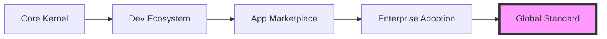
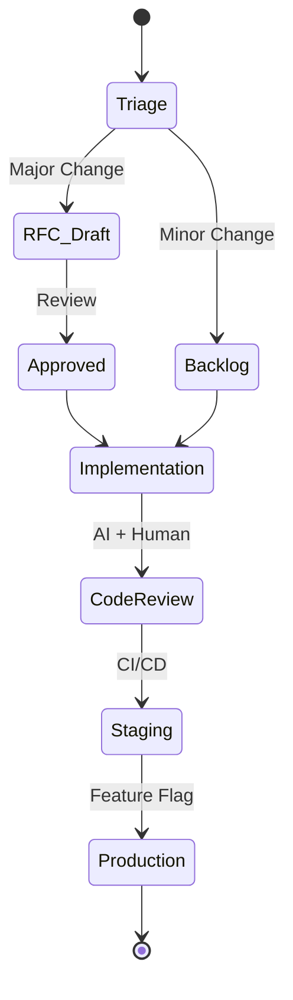

# NexusOS Enterprise Strategy & Master Index

<!-- @META: Strategic Execution Document for NexusOS Enterprise -->
<!--
    File: .opencode/specs/doctrine/ENTERPRISE_STRATEGY.md
    Version: 2.0.0
    Created: 2026-01-07
    Updated: 2026-01-07
    Scope: Enterprise Strategy, Culture, and Roadmap
    Status: Active
    Target Valuation: $200B
-->
<!-- @REF(AGENTS.md): Aligned with Monorepo Constitution -->

---

## 1. Executive Summary

<!-- @NOTE(exec-summary): The "Why" and "What" of NexusOS -->

NexusOS is not merely an operating system; it is the **foundational layer for the Age of AI**. We are building a universal, web-native computing environment that seamlessly integrates human intent with autonomous agent execution.

Our mission is to decouple intelligence from infrastructure, enabling a global ecosystem of AI-native applications to run anywhere, securely and efficiently.

### Core Identity
- **Name**: NexusOS Enterprise
- **Vision**: To be the ubiquitous substrate for 10 billion AI agents.
- **Valuation Target**: $200 Billion USD by FY 2030.
- **Architecture**: Web-native, distributed, agent-centric kernel.

### Strategic Pillars
1. **Universal Accessibility**: Runs on any device with a browser.
2. **AI Sovereignty**: Local-first inference with optional cloud scaling.
3. **Enterprise Grade**: Zero-trust security, 99.999% reliability, complete auditability.

---

## 2. Strategic Vision (5-Year Horizon)

<!-- @NOTE(vision): The path to $200B -->

We operate on a 5-year strategic horizon, broken down by fiscal milestones.

| Horizon | Phase Name | Focus Area | Revenue Target | Key Milestone |
|---------|------------|------------|----------------|---------------|
| **FY 2026** | **Foundation** | Core Kernel Stability, DevEx, Seed Adoption | $0 | Product-Market Fit (PMF) |
| **FY 2027** | **Expansion** | Enterprise Modules, Multi-tenant Hubs | $100M | 1M Active Users |
| **FY 2028** | **Ecosystem** | 3rd Party App Store, Agent Marketplace | $1B | 10k Developer Partners |
| **FY 2029** | **Dominance** | Vertical OS (MedTech, FinTech), Hardware | $10B | IPO Readiness |
| **FY 2030** | **Ubiquity** | Global Standard for AI OS | $50B+ | $200B Valuation |

### Strategic Map

---

## 3. Engineering Culture: "The Nexus Way"

<!-- @REF(AGENTS.md#culture): Inherits from root constitution -->

We build differently. Our culture is designed for **high-velocity autonomous engineering**.

### Core Values

1.  **Documentation IS Code**
    *   *Principle*: If it's not in `AGENTS.md`, it doesn't exist.
    *   *Behavior*: We write the spec before we write the code.
    *   *Measure*: 100% of directories have an up-to-date `AGENTS.md`.

2.  **Autonomy with Alignment**
    *   *Principle*: Sub-orchestrators (Leonidas) and Engineers have full autonomy to execute within defined constraints.
    *   *Behavior*: Don't ask for permission; ask for forgiveness (after passing tests).
    *   *Measure*: Decision latency < 2 hours.

3.  **Radical Transparency**
    *   *Principle*: Information hiding is architectural damage.
    *   *Behavior*: All RFCs, decisions, and post-mortems are public to the org.
    *   *Measure*: Zero private Slack channels for technical decisions.

4.  **Ship to Learn**
    *   *Principle*: The only valid test is production usage.
    *   *Behavior*: Feature flags over long-lived branches.
    *   *Measure*: Deployment frequency > 10/day per squad.

---

## 4. Development Methodology

<!-- @NOTE(methodology): Hybrid Agile/SAFe for AI-Native Teams -->

We utilize the **Nexus Agile Framework (NAF)**, a streamlined adaptation of SAFe (Scaled Agile Framework) optimized for AI-augmented development.

### The Cycle

| Cadence | Duration | Purpose | Artifacts |
|---------|----------|---------|-----------|
| **Sprint** | 1 Week | Tactical execution | Working Code, Updated Docs |
| **Epoch** | 6 Weeks | Strategic alignment (PI Planning) | RFCs, Roadmap Updates |
| **Release** | Continuous | Value delivery | Changelog, SemVer Tag |

### Workflow States

### Roles
- **Product Owner**: Defines *What* (ROI focus).
- **Architect (AI)**: Defines *How* (System design).
- **Leonidas (AI)**: Orchestrates *Execution*.
- **Engineer (Human)**: Validates, Guides, Reviews.

---

## 5. Quality Standards & Metrics

<!-- @REF(AGENTS.md#testing-policy): Testing mandates -->
<!-- @NOTE(dora): We manage by metrics, not feelings -->

We strictly adhere to **DORA (DevOps Research and Assessment)** metrics to measure engineering health.

### DORA Targets (Elite Performance)

| Metric | Definition | Target | Current Status |
|--------|------------|--------|----------------|
| **Deployment Frequency** | How often we ship to prod | **On Demand (Multiple/Day)** | 🟡 Daily |
| **Lead Time for Changes** | Commit to Production | **< 1 Hour** | 🟡 < 24 Hours |
| **Time to Restore (MTTR)** | Recovery from failure | **< 1 Hour** | 🔴 Unknown |
| **Change Failure Rate** | % of deploys causing failure | **< 5%** | 🟢 < 2% |

### Testing Pyramid Policy
1.  **Unit Tests (Vitest)**: 80% Coverage mandatory.
2.  **Integration Tests**: Critical paths only.
3.  **E2E Tests (Playwright)**: Happy paths only.
4.  **AI Audit**: Every PR must be scanned by `audit_report`.

---

## 6. Governance Framework

<!-- @NOTE(governance): Decision making at scale -->

### The RFC Process (Request for Comments)
All architectural changes impacting >1 module MUST go through the RFC process.

1.  **Draft**: Author creates `docs/rfc/RFC-XXX-name.md`.
2.  **Discussion**: Async review period (48h minimum).
3.  **Council**: Review by Architecture Council (Humans + AI Architect).
4.  **Verdict**: `APPROVED`, `REJECTED`, or `WITHDRAWN`.

### Architecture Council
- **Chief Architect** (Human)
- **Head of Engineering** (Human)
- **OpenCode Architect** (AI Model)

### Compliance Gates
- **Gate 1**: `pnpm lint` & `pnpm test` pass.
- **Gate 2**: Security Audit (SAST) pass.
- **Gate 3**: `AGENTS.md` updated.
- **Gate 4**: Peer Review (1 Human + 1 AI).

---

## 7. Security & Compliance

<!-- @SECURITY: Zero Trust Architecture -->

### Security Posture
- **Zero Trust**: No network perimeter. Every request is authenticated.
- **Least Privilege**: Agents run with minimal scoped permissions.
- **Secret Management**: No secrets in code. Vault/Env only.

### Compliance Roadmap
- **2026 Q3**: SOC2 Type I
- **2026 Q4**: GDPR Full Compliance
- **2027 Q1**: SOC2 Type II
- **2027 Q2**: HIPAA (for MedTech vertical)

### Incident Response (SEV Levels)
| Level | Response Time | Description |
|-------|---------------|-------------|
| **SEV-0** | 15 min | Data loss, complete outage. War room immediate. |
| **SEV-1** | 1 hour | Major feature broken. Fix within 4h. |
| **SEV-2** | 4 hours | Minor bug, workaround available. Fix within 24h. |
| **SEV-3** | 24 hours | Cosmetic, annoyance. Fix in next sprint. |

---

## 8. Scaling Strategy (1 to 1000 Engineers)

<!-- @NOTE(scaling): The Tribal Model -->

We use the **Spotify Model** adapted for AI-augmented teams.

### Organizational Units
1.  **Squad (2 Humans + 5 AI)**:
    - Vertical autonomy.
    - Owns a specific feature (e.g., "WebRTC Hub").
    - "Two-pizza team" rule applies to humans only.

2.  **Tribe (4-8 Squads)**:
    - Related domains (e.g., "Real-time Communication").
    - Led by Tribe Lead & Tech Lead.

3.  **Chapter (Horizontal)**:
    - Functional expertise (e.g., "Frontend", "Security").
    - Sets standards across squads.

4.  **Guild (Voluntary)**:
    - Interest groups (e.g., "Prompt Engineering Guild").

### Scaling Phases
- **Phase 1 (Current)**: Monorepo, Single Squad.
- **Phase 2 (50 Eng)**: Split into Tribes, Federated Graph (GraphQL).
- **Phase 3 (200 Eng)**: Micro-frontends, Independent Deployables.
- **Phase 4 (1000 Eng)**: Platform Engineering Team (20% of workforce).

---

## 9. Technology Radar

<!-- @NOTE(radar): Adopt/Trial/Assess/Hold -->

| Ring | Technology | Context |
|------|------------|---------|
| **ADOPT** (Standard) | **React 18+** | Standard UI library. |
| | **TypeScript 5+** | Strict mode enabled everywhere. |
| | **Vite** | Build tool of choice. |
| | **WebRTC** | Real-time communication standard. |
| | **pnpm** | Workspace management. |
| **TRIAL** (Pilots) | **SurrealDB** | Multi-model database. |
| | **Rust** | High-performance WASM modules. |
| | **Tauri** | Desktop wrapper. |
| **ASSESS** (Research) | **WebGPU** | Client-side neural inference. |
| | **CRDTs** | Local-first state sync (Yjs/Automerge). |
| **HOLD** (Legacy/Stop) | **Webpack** | Too slow. |
| | **Redux** | Use Context/Zustand/Signals instead. |
| | **Class Components** | Functional only. |

---

## 10. Repository Health & KPIs

<!-- @REF(.opencode/tasks/audit_report.md): Live health data -->

### Current Snapshot
- **Test Coverage**: ~65% (Target: 80%)
- **Documentation**: 25% missing `AGENTS.md` (Target: 0%)
- **Tech Debt**: Medium (Backend packages unstructured)
- **Security**: 2 Critical Issues (Target: 0)

### Maintenance Policies
- **Boy Scout Rule**: Always leave the code cleaner than you found it.
- **Debt Ceiling**: If tech debt tickets > 20% of backlog, feature work stops.
- **Deprecation**: APIs must be marked `@deprecated` for 1 full major version before removal.

---

## 11. Quick Navigation

<!-- @NOTE(nav): Index of Indices -->

| Resource | Path | Description |
|----------|------|-------------|
| **Monorepo Structure** | `monorepo-structure.md` | Directory map |
| **Documentation Map** | `documentation-index.md` | AGENTS.md hierarchy |
| **Task Backlog** | `.opencode/tasks/backlog.yaml` | Work items |
| **Wiki Index** | `wiki-map.md` | Knowledge base |
| **Architecture** | `architecture.md` | System design |
| **RFCs** | `specs-index.md` | Design specifications |
| **Frontend Map** | `vibeos-react-map.md` | UI components |
| **Backend Map** | `backend-map.md` | Services & APIs |

---

## 12. Cross-References

<!-- @REF(AGENTS.md): The Constitution -->
<!-- @REF(.opencode/BOOTSTRAP.md): Session Init -->
<!-- @REF(pnpm-workspace.yaml): Workspace Config -->

> **Note**: This document is the **Single Source of Truth** for strategic alignment. All sub-agents (Leonidas, Architect, Code) must align their decisions with the Strategic Vision and Engineering Culture defined herein.

**Last Updated**: 2026-01-07
**Approved By**: NexusOS Governance Council
