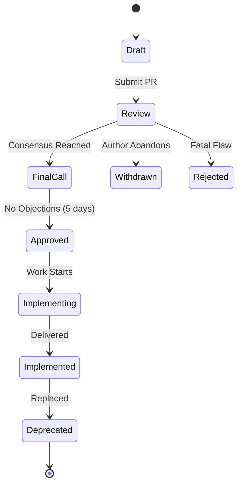

# RFC & Spec Governance System

<!-- @META: System-wide Governance for RFCs, ADRs, and Specifications -->
<!--
    File: .opencode/specs/governance/RFC_GOVERNANCE.md
    Version: 2.0.0
    Created: 2026-01-07
    Updated: 2026-01-07
    Scope: Governance, Lifecycle, and Registry of all System Specifications
-->

---

## 📜 Manifesto

<!-- @NOTE(gov-001): Governance Philosophy -->
> **Codified Decisions**: If it isn't documented in an RFC or Spec, it doesn't exist.
> We prioritize **asynchronous communication**, **structured decision-making**, and **traceability**.

This document defines the **Request for Comments (RFC)** process and serves as the **Master Registry** for all architectural specifications.

---

## 🔄 The RFC Lifecycle

<!-- @RULE: Lifecycle States -->
Every specification moves through a strict state machine.



### State Definitions

| State | Badge | Description | Required Actions |
|-------|-------|-------------|------------------|
| **Draft** | `[Draft]` | Initial thought gathering. Not ready for broad review. | Author drafts content. No wide notifications. |
| **Review** | `[Review]` | Open for comment. PR created. | Reviewers provide feedback. Debate encouraged. |
| **Final Call** | `[Final Call]` | Stabilized. Waiting for final objections. | 5-day silent period. If no blocks, moves to Approved. |
| **Approved** | `[Approved]` | Adopted. Ready for implementation. | Tickets created. Resources assigned. |
| **Rejected** | `[Rejected]` | Not pursuing. Decision recorded. | Reason documented in header. File archived. |
| **Withdrawn** | `[Withdrawn]` | Author retracted proposal. | Archived. |
| **Implemented** | `[Implemented]` | Code is live in production. | Docs reflect reality. |
| **Deprecated** | `[Deprecated]` | Replaced or obsolete. | Link to successor spec. |

---

## 👥 Roles & Responsibilities

<!-- @NOTE(roles): Who does what -->

### 1. The Author
- **Accountability**: Driving the RFC from Draft to Resolution.
- **Tasks**: Writing, responding to comments, updating the text, soliciting reviews.

### 2. The Reviewer
- **Accountability**: Ensuring technical soundness and alignment.
- **Tasks**: Asking hard questions, spotting edge cases, validating security (SOP-002).

### 3. The Shepherd (Optional)
- **Accountability**: Process adherence.
- **Tasks**: Assigned for complex RFCs to manage the debate and ensure it doesn't stall.

---

## 📝 Templates & Standards

### Standard RFC Template

<!-- @SCHEMA: RFC-Template -->
Every RFC MUST include this frontmatter and structure:

```markdown
# RFC-XXX: [Title]

<!-- @META: RFC Definition -->
<!--
    ID: RFC-XXX
    State: Draft | Review | Approved
    Author: [Name]
    Created: YYYY-MM-DD
    Updated: YYYY-MM-DD
    Reviewers: [List]
-->

## Summary
Brief explanation of the proposed change.

## Motivation
Why are we doing this? What is the problem? <!-- @WHY -->

## Design Proposal
Detailed technical specification.
- Architecture diagrams
- Data models
- API definitions

## Drawbacks
Why should we NOT do this?

## Alternatives
What other options were considered?

## Unresolved Questions
What is still TBD?
```

### Architecture Decision Record (ADR)
For smaller, concrete decisions (e.g., "Use library X over Y"), use a lightweight ADR:
- **Title**: Short active phrase.
- **Context**: The situation.
- **Decision**: The choice made.
- **Consequences**: Good and bad outcomes.

---

## 🏆 Spec Quality Metrics

<!-- @RULE: Quality Gate -->
A specification is **Review Ready** when:
1.  **Completeness**: All sections of the template are filled.
2.  **Clarity**: Understandable by a junior engineer.
3.  **Traceability**: Links to parent issues/requirements (`@REQ`).
4.  **Feasibility**: Implementation path is visible.

---

## 🗂️ Master Registry

### 1. Active RFCs (Request for Comments)

<!-- @NOTE: The active queue of proposed changes -->

| ID | Title | State | Author | Progress | Impact | Breaking? |
|----|-------|-------|--------|----------|--------|-----------|
| **RFC-001** | [Monorepo Architecture Alignment](docs/RFC/RFC-001.md) | `[Draft]` | Architect | 0% | Critical | **Yes** |
| **RFC-002** | [Security & Vulnerabilities](docs/RFC/RFC-002.md) | `[Draft]` | Security | 0% | Critical | No |
| **RFC-003** | [Frontend-Backend Integration](docs/RFC/RFC-003.md) | `[Draft]` | Fullstack | 0% | High | No |

*Note: Add project-specific RFCs as they are created.*

### 2. Architecture Specifications

<!-- @NOTE: Foundational system definitions -->

| Spec | Path | State | Component | Type | Last Update |
|------|------|-------|-----------|------|-------------|
| **Main Arch** | `ARCHITECTURE.md` | `[Live]` | Root | System | 2026-01 |
| **System Arch** | `.opencode/docs/architecture.md` | `[Live]` | OpenCode | Agent | 2026-01 |
| **Orchestration** | `.opencode/specs/ORCHESTRATION_ARCHITECTURE.md` | `[Live]` | OpenCode | Logic | 2026-01 |
| **Agents & Skills** | `.opencode/specs/AGENTS_SKILLS_ARCHITECTURE.md` | `[Live]` | OpenCode | Logic | 2026-01 |

### 3. Design Specifications

<!-- @NOTE: Module and Component level designs -->

| Spec | Path | State | Scope | Effort |
|------|------|-------|-------|--------|
| **OpenCode Format** | `.opencode/specs/OPENCODE_FORMAT_REFERENCE.md` | `[Live]` | Core | N/A |
| **Model Selection** | `.opencode/specs/AVAILABLE_MODELS.md` | `[Live]` | Core | N/A |

*Note: Add project-specific design specs as they are created.*

---

## 📈 Implementation Tracking

<!-- @NOTE: Aggregate status of all approved RFCs -->

| Milestone | Linked RFCs | Target | Status |
|-----------|-------------|--------|--------|
| **Foundation** | RFC-001 | TBD | ⚪ Pending |
| **Security** | RFC-002 | TBD | ⚪ Pending |
| **Integration** | RFC-003 | TBD | ⚪ Pending |

*Note: Update milestones as RFCs are approved and work begins.*

---

## 🗑️ Deprecation Policy

<!-- @RULE: EOL Process -->
When a spec becomes obsolete:
1.  **Mark**: Add `deprecated: true` to frontmatter.
2.  **Banner**: Add a warning banner at the top of the file.
3.  **Link**: Explicitly link to the replacement spec.
4.  **Archive**: Move to `archive/` folder if no longer referenced.

### Deprecated Specs
*(None currently listed)*

---

## 🔄 Versioning Strategy

- **Semantic Versioning**: Specs follow `Major.Minor.Patch`.
    - **Major**: Architectural rewrite or breaking change.
    - **Minor**: Feature addition or clarification.
    - **Patch**: Typos, formatting, minor notes.
- **Immutable Tags**: Once Approved, the version is tagged. Changes require a new PR (and potentially a new RFC for Major changes).

---

<!-- @REF(AGENTS.md#sop-001): Source Citation Compliance -->
<!-- @REF(.opencode/BOOTSTRAP.md): System Initialization -->
